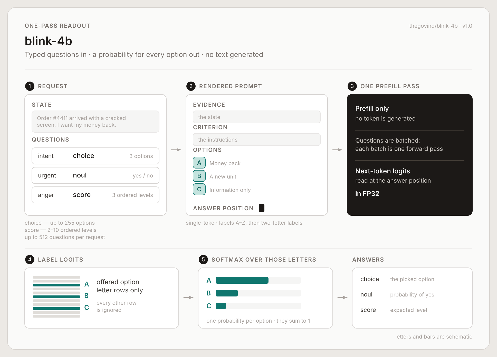
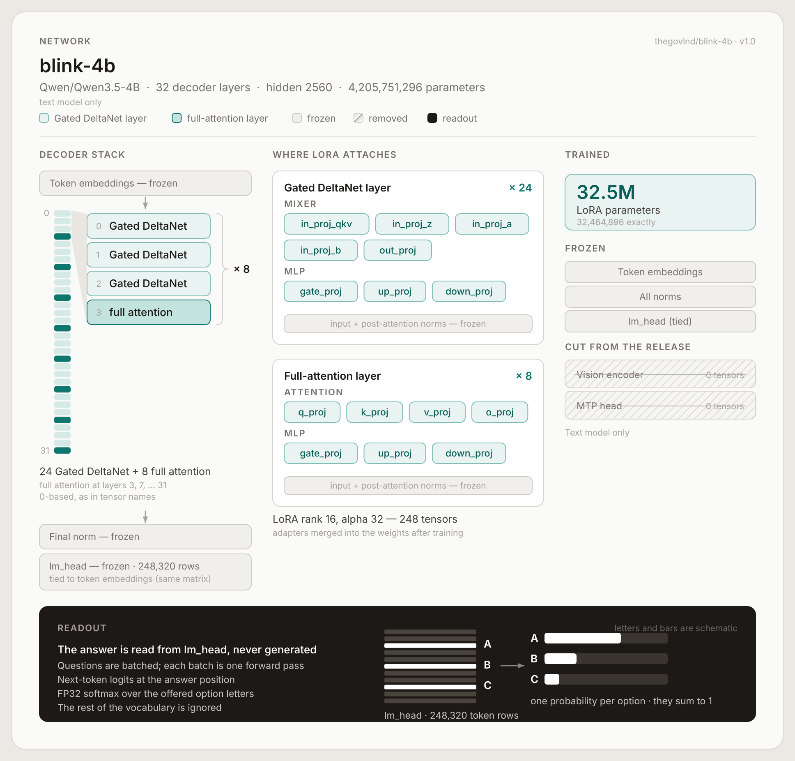

# blink

**Send a state and typed questions; get a probability for every option in one forward pass. No generated text.**



[](LICENSE)
[](https://huggingface.co/thegovind)
[](https://huggingface.co/spaces/thegovind/blink)

**Docs:** [thegovind.github.io/blink](https://thegovind.github.io/blink/)

Three open models are tagged `v1.0`: `thegovind/blink-4b`,
`thegovind/blink-27b`, and `thegovind/blink-mimo-9b`.

## Results

| Model | Decision Index 0.1 | JevBench public hard proxy | Held-out (mean of 8 tasks) |
|---|---:|---:|---:|
| blink-27b | 63.44 | - | 78.3% |
| blink-mimo-9b | 56.53 | 77/111 | 73.5% |
| blink-4b | 52.12 | 80/111 | 68.5% |

Decision Index 0.1 numbers are local runs of the official kit on the archived
edition, not leaderboard submissions. Decision Index 0.2 numbers are also
local, descriptive runs, not accepted leaderboard results. Known training
exposure remains in the 0.2 scores without the leaderboard's penalty, so they
cannot be ranked against leaderboard results. Details are on each model card.
JevBench numbers are public-item development proxies, not official scores.
Held-out numbers were never used for training or for choosing a model.

Methods and caveats: [docs/RESULTS.md](docs/RESULTS.md) and
[docs/EVALUATION.md](docs/EVALUATION.md).

## Quickstart

```bash
git clone https://github.com/thegovind/blink
cd blink
pip install -e ".[serve]"
hf download thegovind/blink-4b --revision v1.2 --local-dir ./models/blink-4b
python -m blink.server --model ./models/blink-4b --port 8000
```

In another shell:

```bash
curl -s http://127.0.0.1:8000/v1/systemone \
  -H 'content-type: application/json' \
  -d @examples/request-mixed.json | python -m json.tool
```

Python client:

```python
from examples.python_client import decide

out = decide(
    "Order 4411 arrived with a cracked screen. The customer wants a refund.",
    {
        "route": {
            "type": "choice",
            "instructions": "Which team should handle this?",
            "criteria": {"returns": "Damaged or wrong items", "billing": "Charges and refunds"},
        }
    },
)
print(out["answers"]["route"]["probabilities"])
```

## How it works



Input is a `state` plus typed `questions`:

- `choice`: 1 to 255 options.
- `noul`: yes/no.
- `score`: 2 to 10 ordered levels.

Each question uses the fixed SemIf JSON prompt. One prefill pass produces the
last-position hidden state; the readout multiplies it by only the offered letter
rows of `lm_head` in FP32, then softmaxes the logits. Labels go A-Z, then AA
onward. No text is generated.

## Training

Plain LoRA supervised fine-tuning with soft and one-hot targets, followed by
weight soups. See [docs/HISTORY.md](docs/HISTORY.md) and the model cards in
[docs/models](docs/models).

## Reproduce evaluations

The server exposes the TypeSafe/Jev-compatible `POST /v1/systemone` wire format.
Use `lab/run_requests.py`, `lab/build_results.py`, `lab/precision_check.py`, and
the benchmark-specific public kits. Notes: [docs/EVALUATION.md](docs/EVALUATION.md).

## Run the Space locally

```bash
pip install -e ".[space]"
BLINK_MOCK=1 make space
```

Mock mode exercises the UI and wire format without downloading weights.

## Limitations

These are model probabilities conditional on the offered options, not certified
chances of truth. Calibration shifts across domains, prompts, and option sets.
Long requests over the configured limits are refused, never truncated. Fast
serving needs an accelerated runtime and the listed dependencies; the
unaccelerated path is mainly for tests and mock mode.

## Roadmap

More public reproduction scripts for benchmark adapters, cleaner hosted
typed-decision examples, and a future release only after pre-registered
evaluation gates pass.

## Contributing

Read [CONTRIBUTING.md](CONTRIBUTING.md) and open focused issues. Include mock-mode
tests for runtime or UI changes. Benchmark claims need the request set, scorer,
and caveats to be reproducible.

## License

Code is Apache-2.0. Weights are hosted separately on Hugging Face for
non-commercial research and evaluation only, as stated in each model card.

## Citation

```bibtex
@misc{blink2026,
  title = {blink: One-pass typed-decision models},
  author = {Kamtamneni, Govind},
  year = {2026},
  howpublished = {Hugging Face models and open-source code},
  note = {Models: thegovind/blink-4b, thegovind/blink-27b, thegovind/blink-mimo-9b}
}
```
