# blink: LLMs and a typed-decision model, from first principles

## Your questions, answered

The wording in the left column preserves the questions as asked. Read the parts in order if these ideas are new; use the links when you need a particular answer.

| Your wording | Go to |
|---|---|
| "all the KL math and all the related stuff" | [Part 5: probability, information, and calibration](#part-5-probability-information-and-calibration) |
| "classifier heads" and "classifier" | [Part 6: classifiers and alternative readouts](#part-6-classifiers-and-alternative-readouts) |
| "lora rank and lapha" | [Part 8: supervised fine-tuning and LoRA](#part-8-supervised-fine-tuning-and-lora); *lapha* means LoRA **alpha** |
| "attention" | [Part 2: what a layer computes](#part-2-what-a-layer-computes) |
| "gated deltanet" | [Part 2: what a layer computes](#part-2-what-a-layer-computes) |
| "mlp projections" | [Part 2: what a layer computes](#part-2-what-a-layer-computes) |
| "how to read all the layers" | [Part 3: read a real checkpoint](#part-3-read-a-real-checkpoint) |
| "model merging" and "how do you merge checkpoints" | [Part 10: merging and grafting](#part-10-merging-and-grafting) |
| "contrastive loss, contrastive stuff" | [Part 7: contrastive learning](#part-7-contrastive-learning) |
| "how training splits?" | [Part 9: data, splits, and distillation](#part-9-data-splits-and-distillation) |
| "contractNLI?" | [Part 9: data, splits, and distillation](#part-9-data-splits-and-distillation) and the [panel guide in Part 13](#part-13-evaluation-and-what-the-numbers-mean) |
| "decision index? kit?" | [Part 13: evaluation and what the numbers mean](#part-13-evaluation-and-what-the-numbers-mean) |
| "distill?" | [Part 9: data, splits, and distillation](#part-9-data-splits-and-distillation) |
| "hidden 4096?" | [Part 1: an LLM from zero](#part-1-an-llm-from-zero) and [Part 4: vision and MiMo](#part-4-vision-and-mimo) |
| "unified embeddings?" | [Part 1: tied versus untied embeddings](#part-1-an-llm-from-zero); there is **no "unified embeddings" setting** here |
| "vision envoders?" and "what are they from basics in mimo?" | [Part 4: vision and MiMo](#part-4-vision-and-mimo); *envoders* means **encoders** |
| "merged and grafted?" | [Part 10: merging and grafting](#part-10-merging-and-grafting) |
| "why are the model safetensors split up? how?" | [Part 11: files, shards, and release revisions](#part-11-files-shards-and-release-revisions) |
| "how are they served?" | [Part 12: serving, Docker, and the Space](#part-12-serving-docker-and-the-space) |

## Part 0: How to use this guide

This is both an LLM primer and a record of **blink** as of **September 24, 2026**. Blink takes a `state` (text or **JSON**, structured text with keys and values) and typed `questions` (`choice`, yes/no `noul`, or ordered `score`). For each question, it returns a **distribution**, probabilities across the options the caller supplied. It does not write an answer sentence. It scores the next-token **logits** (raw, unnormalized scores) of the option letters after reading the prompt. A **forward pass** is one computation through the model; **prefill** processes all positions of an existing prompt. A request with many questions may need several *batched* prefills; it does not generate a token for each question.

Start with Parts 1–5 for the computation. Parts 6–10 explain other designs and the training. Parts 11–14 cover the files, service, measurements, and actual sequence of work. Parts 15–16 are a glossary and hands-on exercises. **A fact about the shipped models is not automatically a fact about every LLM.** Conversely, an illustrative arithmetic example below is not a measured blink result.

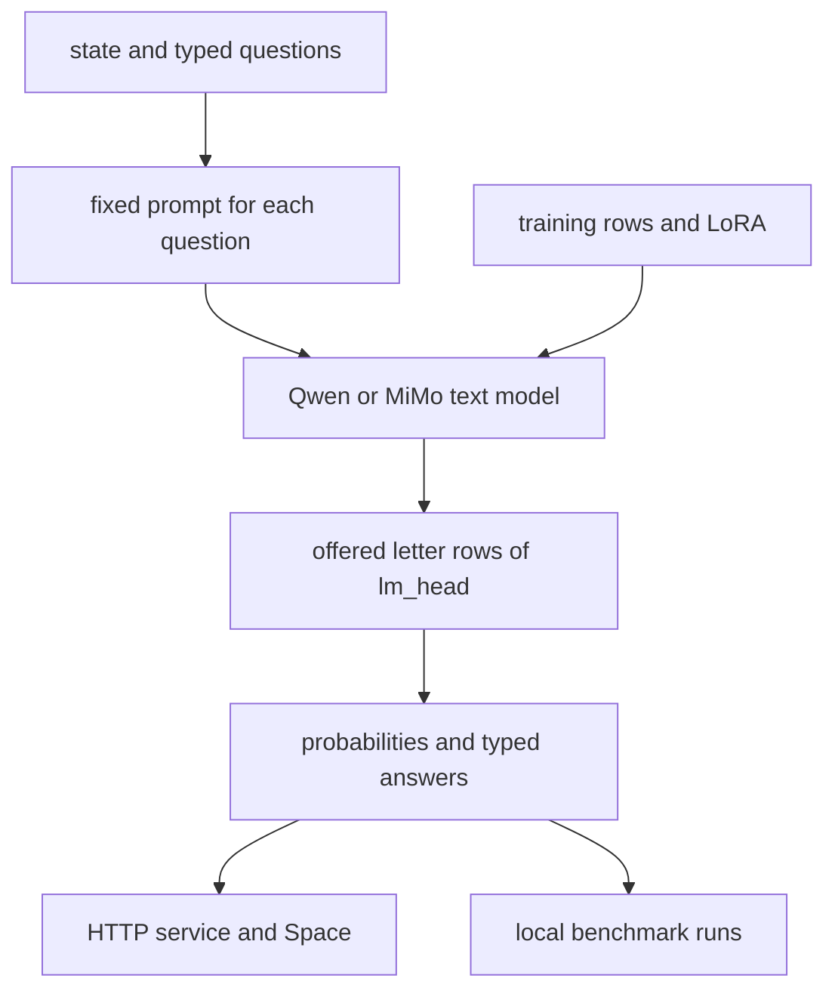

Three **checkpoints** (saved sets of weights) shipped: **blink-4b** is the JevBench entry, **blink-27b** the larger Decision Index model, and **blink-mimo-9b** a vision-language base with decision-trained *text* weights and its original vision tower intact. Their released parameter counts are respectively **4,205,751,296 text**, **26,895,998,464 text**, and **9,409,813,744 total** (8,953,803,264 text plus 456,010,480 vision). "4B", "27B", and "9B" are names rounded to size classes, not exact parameter counts. The 4B/27B releases contain no vision or **multi-token-prediction (MTP)** head; MiMo contains vision but no shipped MTP head. **LoRA** (low-rank trainable updates) is the training method detailed in Part 8. [Verified fact pack](facts/FACTS.md), [checkpoint shapes](facts/tensor-shapes.json).

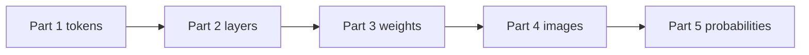

**Evidence convention:** "our run" means a local run, not an official leaderboard entry. Decision Index results here use its **archived 0.1 edition**; the model cards now report **local, descriptive 0.2 runs** with known training exposure left in and no leaderboard penalty, so those scores cannot be ranked against the leaderboard. JevBench public-item figures are **development proxies**, not official JevBench results. The method is **supervised fine-tuning (SFT)**, not Jev's unreleased RLCD method. Model-specific numbers come from the [fact pack](facts/FACTS.md), the three [model cards](../release/out/blink-4b/README.md), [runtime](../space/blink.py), [training code](../lab/jevlab/train.py), and the other sources named in the fact pack.

> **Check yourself — Part 0**
> 1. Does one request always mean exactly one forward pass?
> 2. Are the Decision Index numbers on the live 0.2 board?
> 3. Does blink-mimo-9b train its vision tower for decisions?

<details markdown="1"><summary>Answers</summary>

1. No. One *batch of questions* takes one prefill; a large request can have multiple batches.
2. No. These are local official-kit runs on archived 0.1.
3. No. The vision tower remains unchanged; decision training was text-only.

</details>

## Part 1: An LLM from zero

An **LLM** (large language model) is a parameterized function that assigns scores to possible next tokens given preceding tokens. A **parameter** is a learned number in a tensor (multidimensional array). A **token** is an integer ID for a text piece: it might represent a whole word, part of a word, punctuation, or a special chat boundary. A **tokenizer** maps text to token IDs and back. The blink backbones have a vocabulary of **248,320 token IDs**. The vocabulary size is not the number of words the model "knows"; combinations of pieces can spell new strings. This is why counting the letters in "strawberry" is not the same operation as counting its tokens.

An **embedding** maps one token ID to a learned vector. A vector is an ordered list of numbers; its length is the **hidden size**, also called the residual-stream width. Blink-4b's hidden size is **2560**, MiMo text's is **4096**, and blink-27b's is **5120**. "Hidden 4096" is the width of *each text-token representation at each MiMo text layer*, not the number of layers, tokens, classes, or vision patches. MiMo's vision encoder starts at a different width, **1152**, and its merger outputs text-width vectors; see Part 4.

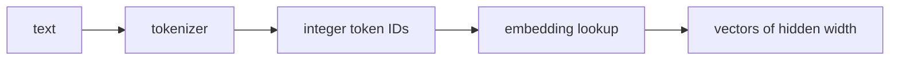

For blink-4b the token-embedding matrix has shape **[248320, 2560]**, meaning one row per token and 2560 numbers per row. An input with 10 tokens begins as a **[10, 2560]** array. A batch of two such inputs begins as **[2, 10, 2560]**. The first axis selects an example, the second a position, the third a component of its vector. A **dimension** is one such axis or component count; it is not a semantic concept like "honesty".

A **layer** repeatedly updates those token vectors. The vectors passed between layers form the **residual stream**: each layer computes a change and adds it to its input, so information can pass through many layers. A **decoder** restricts position $t$ to current and earlier tokens; it cannot look ahead. After the final layer, a **normalization** rescales each vector; here it is root-mean-square normalization (**RMSNorm**). Then the **language-model head** (`lm_head`) produces one logit per vocabulary token. These logits are turned into probabilities by **softmax** in Part 5. **Generation** chooses a next token, appends it, and repeats. Blink instead stops after scoring offered answer tokens at the last prompt position.

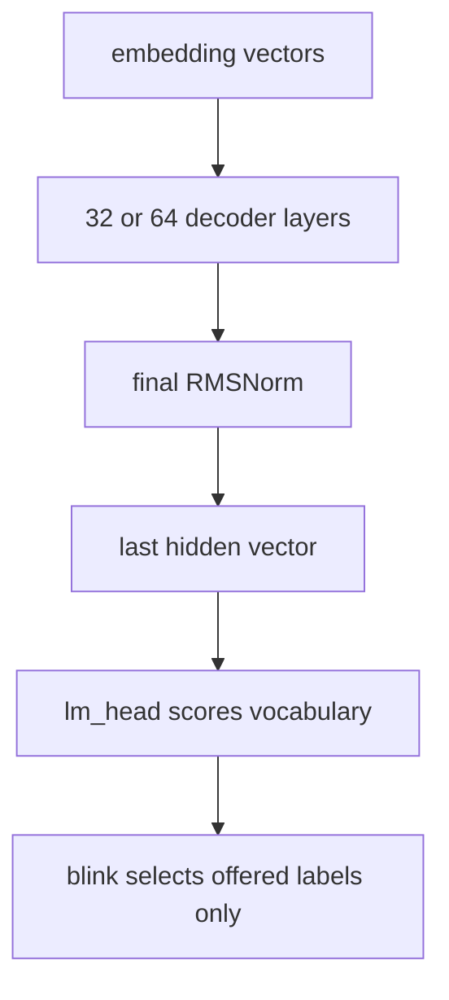

**Pretraining** usually predicts the next token in a large text collection; the loss compares the predicted distribution with the actual next token. This creates language and task knowledge in the base model. **Post-training** changes behavior on a narrower data set. Blink starts from existing pretrained/instruct backbones and applies plain decision-oriented SFT; it does not train the original LLM from scratch and does not use reinforcement learning or preference optimization.

**Tied embeddings** means the input-embedding matrix and output `lm_head` use the *same learned weights*. Blink-4b is tied: there is no separate `lm_head.weight` tensor in its checkpoint. **Untied embeddings** means separate input and output matrices: blink-27b and blink-mimo-9b have an independent `lm_head.weight`. This is what "unified embeddings?" is probably pointing at. No model here has a setting named "unified embeddings." If a token row is shared, freezing embeddings also freezes the output rows; if untied, the separate head must also be frozen explicitly. Both cases use the relevant output rows for blink's readout.

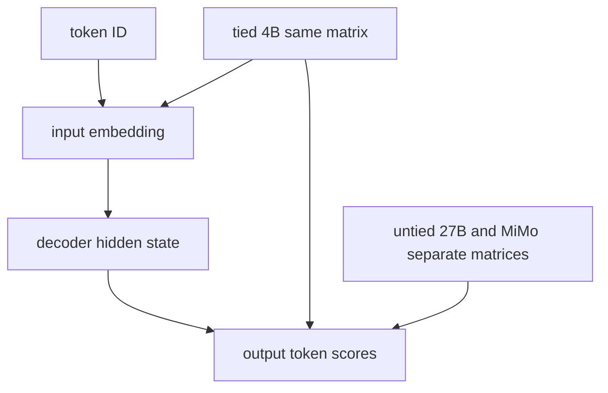

**bf16** (bfloat16) stores a floating-point number in 16 bits, or **2 bytes**. A **FP32** number takes 4 bytes and has more mantissa precision. Ignoring small file headers, checkpoint storage follows

$$
\text{bytes of bf16 weights}\simeq 2\,\text{bytes per parameter}\times\text{parameter count}.
$$

Read it as "count the learned numbers, then allocate two bytes each." For blink-4b, **4,205,751,296 × 2 = 8,411,502,592 bytes**, or about **8.41 decimal GB**; its two actual shards are about **4.97 + 3.44 GB**. This is *weights on disk*, not the full memory needed to serve or train: activations, caches, temporary matrices, optimizer state, and runtime overhead also use memory. Blink-27b is **53.79 GB** in 12 shards; the full MiMo checkpoint is **18.82 GB** in four. The numbers and units come from the shipped tensor headers in [tensor-shapes.json](facts/tensor-shapes.json).

**Prefill** processes all prompt positions and obtains the last hidden state. **Decode** then processes each generated token sequentially, often reusing a **KV cache**, the stored keys and values at previous full-attention positions. For blink-4b's eight full-attention layers, ordinary bf16 decode-cache storage for 1000 tokens would be

$$
2\;(\mathrm{K,V})\times4\;(\mathrm{KV\ heads})\times256\;(\mathrm{head\ dims})\times8\;(\mathrm{layers})\times2\;(\mathrm{bytes})\times1000
=32{,}768{,}000\;\mathrm{bytes}.
$$

Read it as "keep one key and one value per token, KV head, and full-attention layer"; this example is **32.768 MB** before allocator overhead. Gated DeltaNet layers use recurrent state rather than an ever-growing full-attention KV history. **Blink's scoring path sets `use_cache=False` and does not decode**, so the above is an explanation of ordinary generation, *not* a claimed blink allocation. One prefill can be fast relative to decoding an answer token by token, but its computation still grows with prompt length and batch size.

> **Check yourself — Part 1**
> 1. Is hidden size 4096 a vision-token count or a text-vector width?
> 2. Why does the 4B checkpoint have no separate `lm_head.weight`?
> 3. Is an 8.41 GB weights file guaranteed to fit in 8.41 GB of runtime memory?
> 4. What does blink skip after prefill?

<details markdown="1"><summary>Answers</summary>

1. It is MiMo's text-vector width.
2. Its input and output embeddings share one matrix.
3. No; activations and runtime allocations add to the weights.
4. The autoregressive decode loop and its generated tokens.

</details>

## Part 2: What a layer computes

Every blink text layer has an **input RMSNorm**, a token-mixing block, a residual addition, a second RMSNorm, an **MLP** (multilayer perceptron), and another residual addition. Token mixing is either full self-attention or **Gated DeltaNet**. "Self" means that a token attends to positions in its own sequence, not a separate source sequence. Layer indices start at **0**.

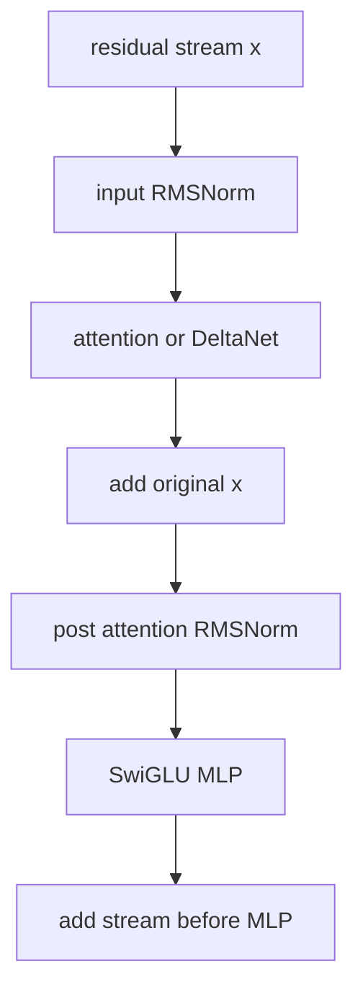

### Full attention, step by step

A **projection** is a learned matrix multiplication. At each position, projections create a **query** (Q: what information to retrieve), **key** (K: how a position can be matched), and **value** (V: information that can be combined). A query's dot product with an earlier key gives a matching score. For one head, with key width $d_k$, the core is

$$
s_{tj}=\frac{q_t^\top k_j}{\sqrt{d_k}}+m_{tj},
\qquad a_{tj}=\operatorname{softmax}_{j}(s_{tj}),
\qquad o_t=\sum_{j\leq t}a_{tj}v_j.
$$

Read it as "compare the current query to each allowed key, normalize the scores across positions, then take a weighted sum of their values." A **causal mask** sets future-position scores to negative infinity, so their softmax probability is zero. Tiny example: with $q=(1,0)$, keys $(1,0)$ and $(0,1)$, and $d_k=2$, the scores are approximately **0.707 and 0**, giving weights **0.670 and 0.330**. If their scalar values are 10 and 0, the output is approximately **6.70**. Blink's real attention head width is **256**, so its score scale is **1/16**; the two-dimensional numbers were solely to show the arithmetic.

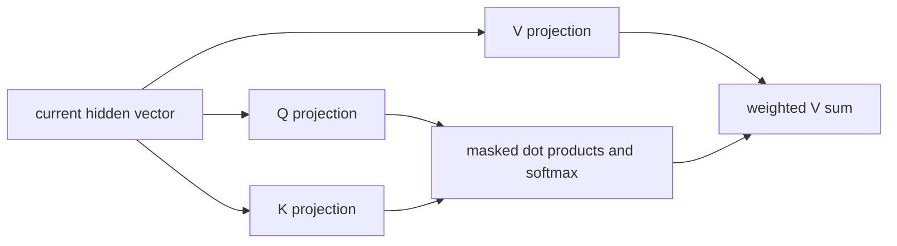

**Multi-head attention** computes this in parallel for several learned Q/K/V subspaces. **Grouped-query attention (GQA)** lets several query heads reuse a KV head, reducing KV storage. In blink-4b and MiMo there are **16 query heads and 4 KV heads**: four Q heads share one K/V head. Blink-27b uses **24 Q heads and 4 KV heads**, so six share one. This is not "hidden size divided by heads": for 4B, **16 × 256 = 4096**, which exceeds its hidden width **2560**. Projections can expand or contract a vector; head count and width do not have to multiply back to hidden size.

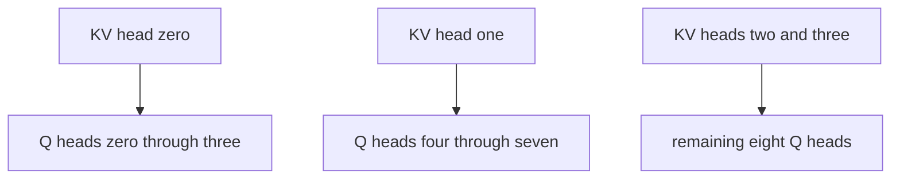

**RoPE** (rotary positional embeddings) rotates paired Q/K components according to token position, making attention sensitive to relative positions without adding a learned full position vector to every text token. Here **25% of 256 = 64 components** of each attention Q/K head are rotated; the other **192** pass through. The configured base `rope_theta` is **10,000,000**, and the multimodal sections are **[11, 11, 10]**; those sections matter to multimodal position handling, not the number of text heads. A toy two-dimensional rotation sends $(1,0)$ to $(0,1)$ at a quarter turn; blink rotates pairs within its first 64 components, not the whole 256-vector. **`q_norm` and `k_norm`** independently RMS-normalize each Q or K head over 256 components before attention.

The actual `q_proj` is **[8192, 2560]** in blink-4b. Why 8192? Sixteen heads produce **4096 query components** and another **4096 learned gate components**, interleaved by head. Attention output has 4096 components, is multiplied by a sigmoid-activated output gate, and goes through `o_proj` **[2560, 4096]** back to hidden width. `k_proj` and `v_proj` are each **[1024, 2560]** (4 × 256). The gate is *not* a second set of attention queries. An 8-token example would have an attention-score array of **[16, 8, 8]** for one 4B input, even though the residual stream is only **[8, 2560]**. Full attention's position-by-position score array grows quadratically with input length.

### Gated DeltaNet, from basic linear attention

In a simple **linear-attention** recurrent view, a key/value pair updates a fixed-size **state matrix**. A query reads that matrix; it does not compare with and retain every earlier key separately. Ignoring normalization, a starting rule could be $S_t=S_{t-1}+k_tv_t^\top$, then $o_t=q_t^\top S_t$. Read it as "add a rank-one key/value update, then query the accumulated state"; with scalar $S_0=0$, $k_1=2$, $v_1=3$, and $q_1=1$, it produces $S_1=6$ and output **6**. Real Gated DeltaNet is more careful: it **decays** memory and writes the *difference* between the new value and what the state already predicts.

For a single value head, let $S$ have shape **[key dimension, value dimension]**, and consider this pedagogical recurrence:

$$
\widetilde S_t=\lambda_t S_{t-1},\qquad
\delta_t=\beta_t\bigl(v_t-k_t^\top\widetilde S_t\bigr),\qquad
S_t=\widetilde S_t+k_t\delta_t^\top,\qquad
o_t=q_t^\top S_t.
$$

Read it in order: decay the old state; read its prediction for this key; scale the prediction error by a write-strength gate; write that correction; read with the query. For a one-number state, old state **1**, decay **0.5**, key **1**, value **0**, write strength **0.5**, and query **1** give decayed state **0.5**, predicted value **0.5**, correction **−0.25**, new state **0.25**, and readout **0.25**. In the real kernel, Q/K are normalized, queries are scaled, and heads are mapped and processed separately; the recurrence is an explanation, not a claim that the scalar example was an observed model state. The official Qwen3.5 reference recurrent implementation uses the same decay → predicted value → correction → outer-product update order (Transformers `modeling_qwen3_5.py`, version 5.17.0).

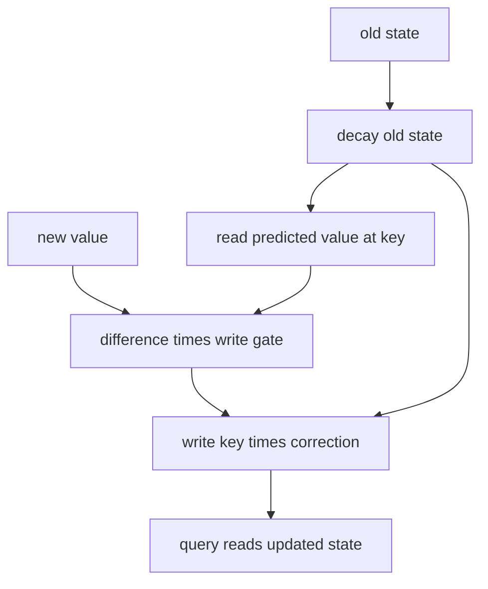

The **decay** and **write gate** are generated at each token:

$$
g_t=-\exp(A_{\log})\,\operatorname{softplus}(a_t+dt_{\mathrm{bias}}),
\quad\lambda_t=\exp(g_t),\quad\beta_t=\operatorname{sigmoid}(b_t).
$$

Read it as "a learned positive rate and a positive input-dependent time step make a retention factor between zero and one; another projection sets write strength between zero and one." For $A_{\log}=0$, $a_t+dt_{\mathrm{bias}}=0$, and $b_t=0$, softplus(0) is ln 2, so **$g_t=-\ln 2$**, retention **0.5**, and write strength **0.5**. `A_log` and `dt_bias` are the stored per-value-head parameters; `in_proj_a` and `in_proj_b` compute $a_t$ and $b_t$ from the hidden state. Our LoRA changed those two projection matrices, **not** the frozen `A_log` and `dt_bias` tensors.

For blink-4b, `in_proj_qkv` **[8192, 2560]** makes Q **16 × 128 = 2048**, K **2048**, and V **32 × 128 = 4096**. Here 32 value heads reuse 16 key heads. A **depthwise causal convolution** (`conv1d` **[8192, 1, 4]**) mixes each Q/K/V channel with at most the current and preceding three positions before the recurrence; it is not global attention. `in_proj_z` **[4096, 2560]** supplies a *different* gate: after the state read, a gated RMSNorm with **[128]** weights normalizes each value head and multiplies by a SiLU-activated $z$; `out_proj` **[2560, 4096]** returns to the residual width. `A_log` **[32]** and `dt_bias` **[32]** cover one value per value head.

For a fixed number and width of heads, updating a fixed-size matrix at each token costs **linear time in sequence length**, usually written $O(n)$ with widths held fixed. Read it as "doubling tokens roughly doubles recurrent mixing work instead of making an $n\times n$ attention-score array"; for **100 → 200 tokens**, there are roughly twice as many recurrent updates, while dense pairwise attention considers about **4×** as many position pairs. Prefill kernels may use parallel chunk algorithms; this is a complexity statement, not a latency prediction. DeltaNet still uses memory for its state, the local convolution, and activations.

### The hybrid, MLP, and RMSNorm

`full_attention_interval=4` makes layers **0, 1, 2** DeltaNet, layer **3** full attention, then the pattern repeats at **7, 11, ...**. Blink-4b and MiMo have **24 DeltaNet + 8 full-attention** layers; 27B has **48 + 16**. The pattern combines bounded recurrent mixing at most layers with occasional global position-to-position access. It does not make the *whole model* strictly linear in context length because some layers retain full attention.

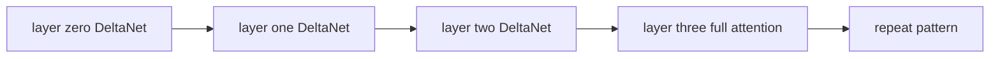

The MLP updates each position separately; it does **not** compare tokens with one another. Blink uses **SwiGLU**, a gated two-branch MLP:

$$
\operatorname{MLP}(x)=W_{\rm down}\left[\operatorname{SiLU}(W_{\rm gate}x)\odot(W_{\rm up}x)\right],
\qquad \operatorname{SiLU}(z)=z\,\operatorname{sigmoid}(z).
$$

Read it as "compute two wide vectors, activate one, multiply them elementwise, and project back." For scalar branches $W_{\rm gate}x=0$ and $W_{\rm up}x=2$, SiLU(0) is 0, so the product and output are **0**; with gate input 1, up output 2 and down weight 1, the output is approximately **1.462**. In blink-4b each of `gate_proj` and `up_proj` is **[9216, 2560]**, while `down_proj` is **[2560, 9216]**. Thus "MLP intermediate size 9216" is the width of each expanded branch, not the hidden width; 27B uses 17408 and MiMo 12288.

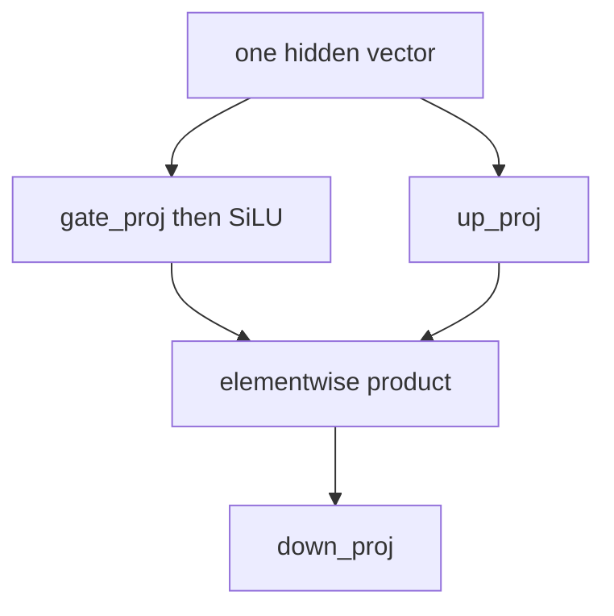

**RMSNorm** (root-mean-square normalization) divides a vector by its root-mean-square magnitude, then applies a learned gain. For a generic vector of width $d$,

$$
\operatorname{RMSNorm}(x)=\gamma\odot
\frac{x}{\sqrt{\frac1d\sum_i x_i^2+\epsilon}}.
$$

Read it as "scale by the vector's typical magnitude, then learn componentwise rescaling"; with $x=(3,4)$, $\epsilon\approx0$, and gains $(1,1)$, RMS is $\sqrt{12.5}\approx3.536$ and the result is approximately **(0.849, 1.131)**. Qwen3.5's *ordinary* RMSNorm stores a **zero-centered** gain, so its effective multiplier is `1 + weight`, not the bare saved weight. Its *gated DeltaNet* RMSNorm uses its saved weight directly and an additional SiLU gate. `rms_norm_eps` is **1e-6** in these configs; epsilon prevents division by zero. A name ending `layernorm` in the text checkpoint refers to this RMSNorm implementation, not automatically to the mean-centering LayerNorm used inside the MiMo vision tower.

> **Check yourself — Part 2**
> 1. Why is blink-4b `q_proj` 8192 wide when it has only 16 heads of width 256?
> 2. What does the delta rule write if the stored state already predicts the new value exactly?
> 3. Where are the full-attention layers in a 32-layer blink text model?
> 4. Does an MLP move information between token positions?

<details markdown="1"><summary>Answers</summary>

1. It emits 4096 Q components **and** 4096 output-gate components.
2. Zero correction, aside from decay; its prediction error is zero.
3. Indices 3, 7, 11, 15, 19, 23, 27, and 31.
4. No. Attention/DeltaNet mix positions; the MLP acts on each position's vector.

</details>

## Part 3: Read a real checkpoint

A **checkpoint** is a saved set of parameters plus configuration and tokenizer files. `config.json` specifies the architecture and its dimensions; `.safetensors` files hold actual numbers. A **tensor name** identifies where a parameter belongs. Read `model.language_model.layers.7.self_attn.q_proj.weight` left to right: text model → decoder layer index 7 → full attention → Q-plus-gate projection → matrix. By contrast, layer 0 has `linear_attn.in_proj_qkv.weight`. Each linear layer's saved shape is **[output components, input components]**, so **[8192, 2560]** consumes a 2560-wide hidden vector and emits 8192 components. A normalization weight is a one-dimensional vector, not a matrix.

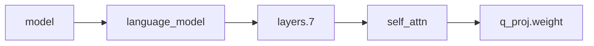

Work with the actual [4B config](facts/blink-4b.config.json) and [tensor-name list](facts/blink-4b.tensor-names.json), not just the model's nickname. Key config fields:

| Field | How to read it here |
|---|---|
| `architectures`, `model_type` | The loader's text-model class; MiMo's outer config is instead a conditional-generation vision-language model with `text_config` and `vision_config`. |
| `vocab_size=248320`, `hidden_size` | Token rows and residual width. These determine the embedding shape. |
| `num_hidden_layers`, `layer_types`, `full_attention_interval=4` | Count layers and check exactly which are attention versus DeltaNet; do not infer the pattern from parameter count alone. |
| `num_attention_heads`, `num_key_value_heads`, `head_dim=256` | Full-attention Q count, reusable KV count, and per-head width. |
| `linear_num_key_heads`, `linear_num_value_heads`, `linear_key_head_dim`, `linear_value_head_dim` | DeltaNet state geometry, separate from full-attention geometry. |
| `intermediate_size`, `hidden_act=silu` | Width and nonlinearity of the MLP. |
| `rms_norm_eps=1e-6`, `attn_output_gate=true` | Stability constant and gated full-attention output. |
| `rope_parameters`, `partial_rotary_factor=0.25` | Positional rotation settings; 64 of 256 head components rotate. |
| `linear_conv_kernel_dim=4` | Local causal convolution width in DeltaNet. |
| `tie_word_embeddings`, `dtype=bfloat16` | Shared versus separate output matrix; stored weight precision. |
| `max_position_embeddings=262144`, `use_cache=true` | Model configuration capacity and possible generation cache; **blink's own request limit is 131072 tokens per question and its forward uses `use_cache=False`**. |
| `mtp_num_hidden_layers` | An architecture setting; it does **not** imply an MTP head was shipped in these release files. |
| `attention_bias=false`, `attention_dropout=0.0` | Full-attention projections omit additive biases and use no attention dropout in this config. Do not confuse these with MiMo vision layers' biases. |
| `bos_token_id`, `eos_token_id`, `pad_token_id` | Begin/end/pad token IDs or `null`; `eos_token_id` is **248044** here. The saved begin ID can be `null` or **248044**, and the saved pad ID is `null`; `blink.py` chooses a runtime pad ID when necessary. |
| `initializer_range=0.02`, `mlp_only_layers=[]` | Initialization setting for creating weights; no special MLP-only layer indices in these text configs. It is not a training rate used for blink's LoRA. |
| `mamba_ssm_dtype=float32`, `linear_key_head_dim`, `linear_value_head_dim` | State-computation precision setting and DeltaNet per-head widths; the two widths are both **128** here. |
| `rope_theta=10000000`, `mrope_section=[11,11,10]`, `mrope_interleaved=true` | Frequency scale and multimodal positional-layout settings in the RoPE configuration; they are not new matrices of trained 11-wide heads. |
| `mtp_use_dedicated_embeddings=false`, `output_gate_type` | Other serialized architecture settings; only the 27B config explicitly lists `output_gate_type=swish`. Check the loader implementation before assuming every extra config field changes inference, and check tensor names before claiming an MTP tensor exists. |
| `transformers_version` | Library version recorded with the config, not a parameter value; MiMo's outer file also contains a nested `text_config` and `vision_config`. |

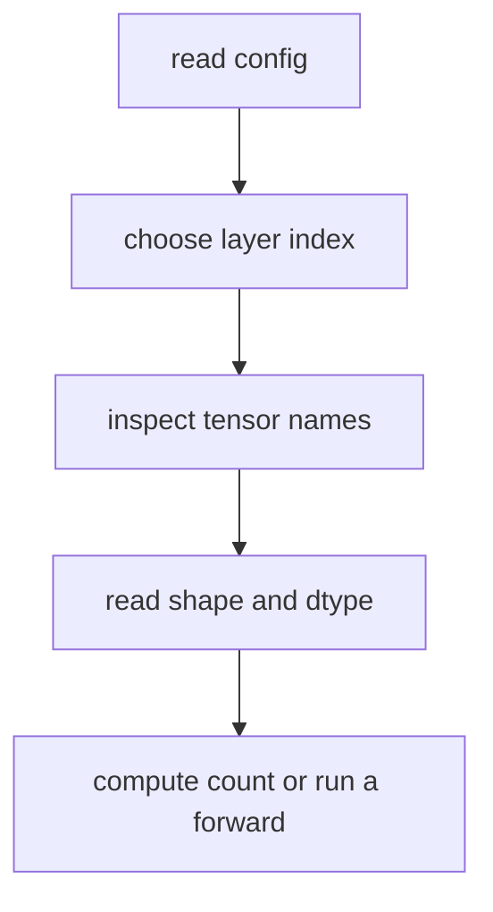

You can reconstruct blink-4b's count without trusting "4B." Its embedding has **248320 × 2560 = 635,699,200** parameters. One DeltaNet layer, *including* its MLP and two outer norms, has **112,923,840**. One full-attention layer including its MLP and outer norms has **107,484,672**. The final RMSNorm adds **2560**. Then

$$
635{,}699{,}200 + 24(112{,}923{,}840) + 8(107{,}484{,}672) + 2{,}560
=4{,}205{,}751{,}296.
$$

Read it as "one embedding, 24 DeltaNet layers, eight full-attention layers, one final norm"; substituting the four displayed terms gives the exact released parameter count. The per-layer MLP alone has **3 × (9216 × 2560) = 70,778,880** weights. `q_proj` alone has **8192 × 2560 = 20,971,520**. The sum includes small conv, gate, and norm tensors, so approximating each layer by only Q/K/V and MLP will miss some parameters. For 27B use the [27B config](facts/blink-27b.config.json) and [names](facts/blink-27b.tensor-names.json); for MiMo use its nested [config](facts/blink-mimo-9b.config.json), [names](facts/blink-mimo-9b.tensor-names.json), and [all shapes](facts/tensor-shapes.json). Their exact released counts are in Part 0.

> **Check yourself — Part 3**
> 1. What does the first axis of a saved linear weight mean?
> 2. Which layer name should you expect at index 7 in blink-4b?
> 3. Does `mtp_num_hidden_layers` prove an MTP tensor exists in the release?

<details markdown="1"><summary>Answers</summary>

1. The number of output components.
2. `self_attn`, including `q_proj`, `k_proj`, `v_proj`, and `o_proj`.
3. No. Inspect shipped tensor names; the 4B and 27B text cuts and MiMo graft ship no MTP tensors.

</details>

## Part 4: Vision and MiMo

A **vision-language model (VLM)** accepts image inputs as well as text. A **vision encoder** converts pixels into numerical image tokens that the text decoder can consume. A **pixel** holds color-channel values; a **patch** is a small spatial region of pixels. Unlike a text token, an image patch is produced by image processing and a learned projection, not by looking up an ID in the text tokenizer's vocabulary.

MiMo's real vision tower begins with a **3D convolution** (`Conv3d`) whose weight is **[1152, 3, 2, 16, 16]**: 1152 output channels; three color inputs; a temporal window of two frames; a 16 × 16 pixel spatial patch. "3D" means time, image height, and image width. It can represent still images through the processor's temporal handling too; the weight's temporal size alone does not tell you the exact tokens produced by a particular uploaded image. There are learned vision position embeddings **[2304, 1152]**, then **27 transformer blocks** at width **1152** with **16 heads**. A vision block's `attn.qkv` is **[3456, 1152]**, and its MLP maps **1152 → 4304 → 1152**. The vision blocks use LayerNorm weights *and biases*. These are distinct from text's RMSNorm layers.

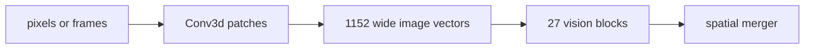

The **merger** groups **2 × 2 adjacent spatial patches**. Four 1152-wide outputs concatenate to **4608** components, go through `merger.linear_fc1` **[4608, 4608]**, then `linear_fc2` **[4096, 4608]**. Now an image token has the text decoder's **4096**-component width. As a deliberately simplified shape example, two 32 × 32 frames contain four 16 × 16 spatial patch positions; one 2 × 2 merge turns those four vectors into one 4096-wide token, *ignoring actual resizing, cropping, and processor packing*. That arithmetic explains the dimensions but is not a measured image-token count for the released processor. Vision start/end and image-token markers tell the decoder where these vectors belong in the sequence.

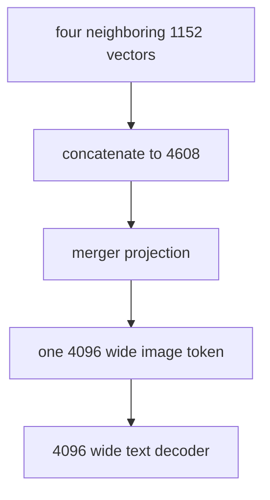

MiMo's released checkpoint has **333 vision tensors** and **456,010,480 vision parameters**; they are **unchanged byte for byte** from the MiMo parent. Its **8,953,803,264 text parameters** contain the decision-trained updates. The shipped complete checkpoint loads as a VLM with its processor. But `blink.py`, `serve.py`, and the public Space use **only the text side** for typed decisions; the decision training was text-only. The reported screenshot next-click scores came from a **separate probe harness**, not from `blink.py` on an image state. Blink-4b and blink-27b also originated from vision-language families, but their release checkpoints intentionally ship **text only**.

MiMo's `vision_config` records `depth=27`, `hidden_size=1152`, `num_heads=16`, `intermediate_size=4304`, `patch_size=16`, `temporal_patch_size=2`, `spatial_merge_size=2`, and `out_hidden_size=4096`: these match the tower's saved shapes. Its `hidden_act=gelu_pytorch_tanh` selects a GELU-family nonlinearity for vision, distinct from the text MLP's SiLU. `deepstack_visual_indexes=[]` means no listed deep-stack visual insertion points. The outer config's `image_token_id`, `video_token_id`, and `vision_start_token_id`/`vision_end_token_id` identify modality/boundary tokens; they are vocabulary IDs, not a claim that every text-only decision includes an image. [MiMo config](facts/blink-mimo-9b.config.json).

> **Check yourself — Part 4**
> 1. Is a 1152-wide patch already the right width for MiMo's 4096-wide text layers?
> 2. Do MiMo's screenshot probe results prove the public blink API accepts screenshots?
> 3. Which MiMo parameters changed during our decision training?

<details markdown="1"><summary>Answers</summary>

1. No. The merger converts grouped patches to 4096-wide tokens.
2. No. Screenshots were evaluated separately; the public decision runtime is text-only.
3. The selected text projection matrices. The vision tower and unselected text tensors stayed unchanged.

</details>

## Part 5: Probability, information, and calibration

Start with three offered options and illustrative logits **(2, 1, 0)**. Logits are not probabilities. **Softmax** first exponentiates relative scores and normalizes:

$$
p_i(T)=\frac{\exp(z_i/T)}{\sum_j\exp(z_j/T)},\quad T>0.
$$

Read it as "divide scores by a positive **temperature** $T$, exponentiate, and divide by their total." With logits **(2, 1, 0)** and **$T=1$**, the exponentials are about **(7.389, 2.718, 1)** and the resulting probabilities are **(0.66524, 0.24473, 0.09003)**. At **$T=2$** they become **(0.50648, 0.30720, 0.18632)**: a higher temperature flattens the distribution without changing its highest option. For numerical stability implementations subtract the largest logit first; that changes no probabilities. **Blink's release default is $T=1.0$, not a fitted value**; an explicit caller override is possible. Softmax is over the **offered letter tokens only**, not over all 248,320 vocabulary IDs.


A **target distribution** $t$ assigns desired probability to each option; a **predicted distribution** $p$ contains model probabilities. Targets can be **one-hot** (all mass on the correct answer) or **soft** (several nonzero values). **Entropy** measures uncertainty of a distribution, in natural-log units called **nats**:

$$
H(t)=-\sum_i t_i\ln t_i.
$$

Read it as "average surprise of outcomes drawn from $t$." For **$t=(0.5,0.3,0.2)$**, entropy is **$-(0.5\ln0.5+0.3\ln0.3+0.2\ln0.2)=1.02965$ nats**. A certain target such as **(1,0,0)** has entropy zero, using the standard convention that a zero-mass term contributes zero.

**Cross-entropy (CE)** measures how much probability the model assigns to the target distribution:

$$
\mathrm{CE}(t,p)=-\sum_i t_i\ln p_i.
$$

Read it as "average negative log probability under the model, when outcomes follow the target." With **$t=(0.5,0.3,0.2)$** and the softmax above, CE is approximately **$0.5(0.40761)+0.3(1.40761)+0.2(2.40761)=1.10761$ nats**. With the one-hot target **(1,0,0)** instead, CE is **$-\ln0.66524=0.40761$**; this is also the **negative log-likelihood (NLL)** of option 1. During training blink minimizes this offered-label CE in FP32, weighted by each row's specified training weight.

**Kullback–Leibler divergence (KL)** measures the extra log loss incurred by predicting $p$ when the target is $t$:

$$
D_{\mathrm{KL}}(t\|p)=\sum_i t_i\ln\frac{t_i}{p_i}
=\mathrm{CE}(t,p)-H(t).
$$

Read it as "compare target odds to predicted odds, average under the target"; for the same three-option numbers it is **$1.10761-1.02965=0.07795$ nats**. It is nonnegative and zero only for matching distributions (where target mass is defined). It is **not symmetric**: reversing the arguments yields approximately **$D_{\mathrm{KL}}(p\|t)=0.06826$** on these numbers. With zero probabilities, the direction matters even more: if target is **(1,0,0)** and prediction is **(0.7,0.2,0.1)**, forward KL is **$-\ln0.7=0.35667$**, while reverse KL is infinite because the prediction puts mass where target mass is zero. "Forward" and "reverse" are relative to which distribution you call the target; always write the argument order.

If a restricted student cannot exactly represent every possible target distribution, forward KL generally resists assigning too little probability to any target-supported outcome; reverse KL can prefer concentrating on a subset when spreading mass is costly. This is a tendency under approximation, **not** a universal law that determines a model's behavior from the name of its loss. Blink's training uses CE with teacher/base targets in the **target-to-student** direction described above, not a reverse-KL optimizer.

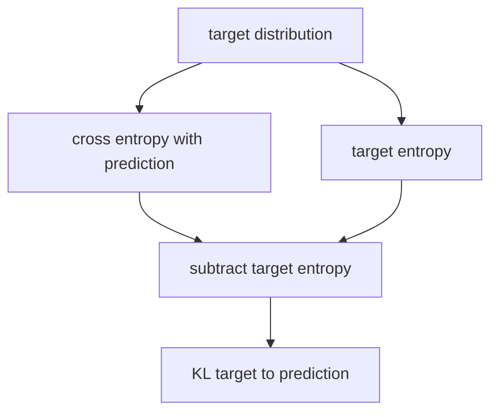

Why say that blink's soft-target CE "is KL"? The **model's parameters change $p$ but do not change a fixed target $t$**, so $H(t)$ is constant during optimization. Minimizing CE(t,p) therefore minimizes KL(t‖p) with identical gradients. For the worked example, **CE 1.10761 = KL 0.07795 + fixed entropy 1.02965**. This is not two separate loss terms. On 4B **base-model anchors**, the frozen base supplies $t=p_{\rm base}$, so the same loss minimizes **KL(base‖student)** on those examples. The teacher-authored and exact-probability rows supply other soft targets. None of this makes the training reinforcement learning.

**Calibration** asks whether predicted probabilities correspond to observed frequencies on a specified evaluation population. If cases predicted at 0.8 confidence are correct roughly 80% of the time, they are calibrated on that population; high accuracy alone does not guarantee this. A *conditional option score* also is not a certified probability of correctness. A missing correct option, a changed domain, or a new option description can break the interpretation.

**ECE** (expected calibration error) bins predictions by their top-option probability, then averages absolute confidence–accuracy gaps. One common empirical form is

$$
\mathrm{ECE}=\sum_b\frac{n_b}{N}\left|\operatorname{acc}(b)-\operatorname{conf}(b)\right|.
$$

Read it as "weight each bin's confidence-versus-frequency gap by its sample share." If ten of twenty cases are 80%-confident but 60% correct and the other ten are 50%-confident but 60% correct, ECE is **$0.5|0.6-0.8|+0.5|0.6-0.5|=0.15$**. Binning and sample choice affect ECE, and low ECE on public hard items need not transfer to sealed items.

The **Brier score** for a multi-option one-hot result is the sum of squared probability errors; **TVD** (total variation distance) compares two whole distributions:

$$
\operatorname{Brier}(p,y)=\sum_i(p_i-y_i)^2,
\qquad
\operatorname{TVD}(p,t)=\frac12\sum_i|p_i-t_i|.
$$

Read Brier as "square each option's prediction error and add it" and TVD as "half the total probability mass that must move to make the distributions agree." With **$p=(0.66524,0.24473,0.09003)$** and one-hot **$y=(1,0,0)$**, Brier is **0.18006** under this sum convention; with **$t=(0.5,0.3,0.2)$**, TVD is **0.16524**. Some scoring conventions divide Brier by the number of options; check the evaluator before comparing reported numbers. NLL and Brier are *proper scoring rules*: in expectation they reward an honest probability distribution, not just the right argmax. ECE, TVD, Brier, and NLL answer related but different questions.

Blink's `choice` response additionally includes its own normalized **concentration** field:

$$
\operatorname{confidence}=\frac{p_{\max}-1/K}{1-1/K}.
$$

Read it as "rescale the maximum offered-option probability so a uniform $K$-way prediction starts at zero and a certain one ends at one." With **$K=3$** and **$p_{\max}=0.66524$**, it is approximately **0.498**. For the supported one-option case, the code returns **1.0** rather than dividing by zero. It is **not** the same as the raw 0.66524 top-option probability used in ordinary reliability checks; it does not estimate the chance blink is correct.

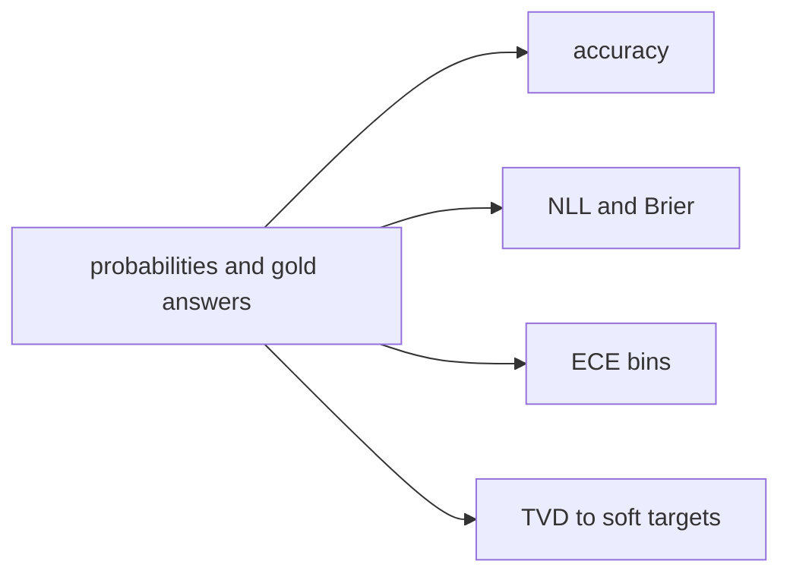

> **Check yourself — Part 5**
> 1. What is the softmax of three equal offered-label logits?
> 2. Which KL direction do base anchors train with a base target?
> 3. Is blink's `confidence` field the top-label probability or a correctness guarantee?
> 4. Why can a higher temperature change calibration but not the argmax?

<details markdown="1"><summary>Answers</summary>

1. One third per option.
2. KL(base‖student), up to constant base entropy.
3. Neither. It is a rescaled concentration measure.
4. Dividing all logits by the same positive number preserves their order but changes their gaps and softmax probabilities.

</details>

## Part 6: Classifiers and alternative readouts

A **classifier** assigns a score or probability to a finite set of labels. A **classifier head** is a trained output module, commonly a linear layer added above a hidden vector. If a model returns a vector $h$ of width 2560 and the task has three fixed classes, one could train a matrix **[3, 2560]** and a three-component bias:

$$
z=Wh+b,\qquad p=\operatorname{softmax}(z).
$$

Read it as "produce one logit per fixed class and normalize"; if $z=(2,1,0)$, the classifier probabilities are **(0.66524, 0.24473, 0.09003)**. A **pooled** vector summarizes the input, for example its final token or an encoder's designated classification token. A new head is sensible for stable labels with dedicated labeled data, but its three outputs cannot automatically score a fourth class supplied at request time.

Blink is a classifier in function, **but it has no added classifier head**. It renders each offered option as an uppercase-letter token, takes the *last prompt hidden vector*, selects only the corresponding **existing `lm_head` rows**, computes their dot products in FP32, then softmaxes them. A **verbalizer** is this mapping from a class/option to a token the LLM already knows. Keys such as `refund` are mapped to letter rows at request time; the answer maps the letters back to keys. Training LoRA changes how the *body* represents the prompt while embeddings, `lm_head`, and all norms stay frozen. At inference a new option description can be used without training a new output neuron.

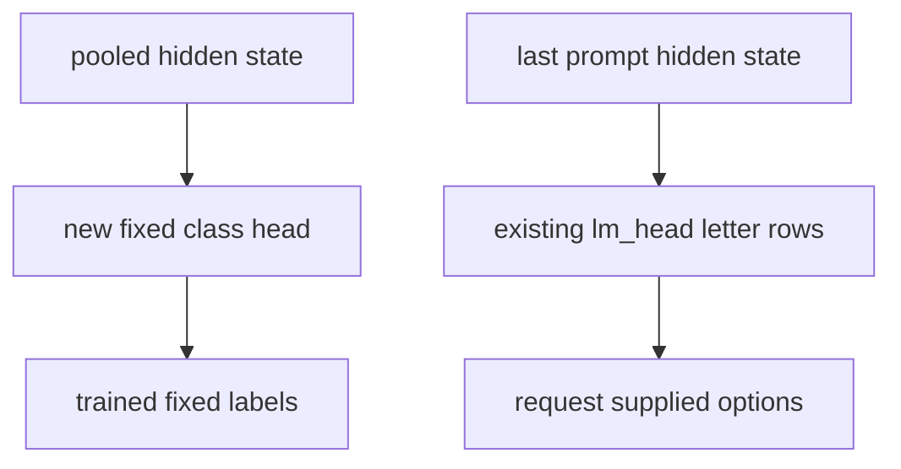

A **reranker** judges each candidate against a query or state. A yes/no verbalizer can score each pair with two logits and use their difference as **log-odds**:

$$
P(\text{yes}\mid x,c)=\frac{e^{z_{\rm yes}}}{e^{z_{\rm yes}}+e^{z_{\rm no}}}
=\operatorname{sigmoid}(z_{\rm yes}-z_{\rm no}).
$$

Read it as "normalize the yes and no logits for this one candidate"; with yes logit **2** and no logit **1**, yes probability is approximately **0.731**. These *independent per-candidate* yes probabilities need not sum to one across candidates. To produce an exclusive choice, normalize comparable candidate scores across the whole offered set and validate that every option is present.

An **encoder** turns an input into vector representations rather than generating next tokens. A **bi-encoder** encodes state and each candidate *separately*, compares their embeddings with a dot product or cosine similarity, and can cache reusable candidate vectors. A **cross-encoder** reads the state and a candidate *jointly*, allowing token-level interaction, normally with a separate pass per candidate. Blink also reads the state and options jointly but in **one prompt per question**, not one encoder pass per candidate. A bi-encoder can still accept brand-new options at request time: it just has to embed them; do not confuse optional fine-tuning for quality with mandatory per-option training.

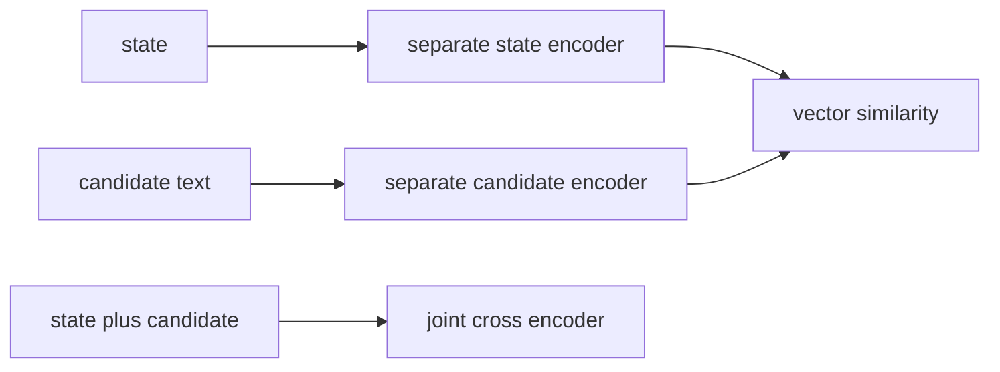

| Design | What is trained/read at output | New request-defined options | Primary trade-off |
|---|---|---|---|
| Fixed classifier head | New class rows atop pooled hidden state | Not without redesign/retraining | Direct and cheap for fixed labels. |
| Blink label-token readout | Existing `lm_head` rows for offered letters | Yes, within limits | One joint prompt per question; option wording matters. |
| Yes/no reranker | Per-candidate yes/no log-odds | Yes | More joint passes; scores need care for exclusive choice. |
| Bi-encoder | Separate reusable state and candidate embeddings | Yes | Reuse and caching; less direct joint token interaction. |
| Cross-encoder | Joint state/candidate encoding | Yes | Rich pair interaction, usually more computation for many options. |

> **Check yourself — Part 6**
> 1. Did blink add a three-class matrix above its decoder?
> 2. Do separate yes probabilities for three candidates have to sum to one?
> 3. Does accepting new options imply a bi-encoder must be retrained?

<details markdown="1"><summary>Answers</summary>

1. No. It reuses offered-label rows of the existing language-model head.
2. No. Each yes/no comparison is a separate event.
3. No. It can embed unseen option text; fine-tuning is a quality choice, not a schema requirement.

</details>

## Part 7: Contrastive learning

**Contrastive learning** trains related items (**positives**) to score higher than unrelated or deliberately confusing items (**negatives**). An **embedding** in this setting is a vector intended for comparison. A common loss, **InfoNCE**, chooses the correct partner from a set of candidates:

$$
L_i=-\log\frac{\exp(s(x_i,y_i)/\tau)}
{\sum_j\exp(s(x_i,y_j)/\tau)},\quad\tau>0.
$$

Read it as "softmax similarity scores against one positive and all offered negatives, then take the negative log of the positive's probability." If the positive similarity logit is **2** and two negatives score **1** and **0** at temperature **1**, positive probability is **0.66524** and loss is **0.40761 nats**. **Temperature** here scales similarity logits just as it does class logits: changing it sharpens or flattens how strongly negatives compete. Negatives that are actually valid answers are **false negatives** and can damage training; a "hard negative" is a wrong answer that looks plausibly similar, *not* a false negative.

```mermaid
flowchart TB
  A["input item"] --> B["encoder"]
  C["matching partner"] --> D["encoder"]
  E["other partners"] --> D
  B --> F["similarity matrix"]
  D --> F
  F --> G["InfoNCE loss"]
```

With a batch of three matched pairs, compute a **3 × 3 similarity matrix**. Its diagonal contains the intended matches. A row-wise CE asks each input to select its partner; a column-wise CE asks each partner to select its input. This **bidirectional** loss is common when two kinds of input, such as text and images, are both queried. **CLIP** (Contrastive Language–Image Pre-training) contrasts matching images/text; **SimCLR** contrasts different views of the same image. These are examples of an objective, not algorithms blink used. An *encoder* may still be an LLM backbone; the distinction is how its vector and loss are used. See the original CLIP and SimCLR papers for their respective training details, and [review/clm.md](../review/clm.md) for the project comparison.

```mermaid
flowchart LR
  A["three states"] --> B["three by three scores"]
  C["three matched actions"] --> B
  B --> D["row loss"]
  B --> E["column loss"]
  D --> F["average both directions"]
  E --> F
```

**CLM (Contrastive-LM)**, the proposal we examined, is a bi-encoder with separate state/action projections, similarity scoring, and a contrastive objective. Its interface accepts new options without per-scenario training; the concern that every new option set *requires* a fine-tuned head was incorrect. Its strongest advertised specialized results, however, use separately fine-tuned heads. The [review](../review/clm.md) reports a weak **zero-shot** CLM result on live Decision Index **0.2** and better task-specific claims after fine-tuning. **Do not numerically compare that 0.2 result to blink's 0.1 numbers**; they are different editions with different transformations. We kept blink's one-prompt, label-token approach. Possible future ideas such as candidate caching or an auxiliary contrastive term were *ideas*, not features of the released training or service.

Blink *does* include confusable options and program-generated distractors in supervised rows. That makes examples harder but **does not turn its CE objective into InfoNCE**: it trains a probability distribution over each prompt's offered letter tokens, without a separately trained pair of embedding heads or an in-batch contrastive term.

> **Check yourself — Part 7**
> 1. In a three-pair similarity matrix, where are the intended positives?
> 2. Must CLM fine-tune for every brand-new option set at request time?
> 3. Did blink train with an InfoNCE auxiliary loss?

<details markdown="1"><summary>Answers</summary>

1. On the diagonal when matched pairs share an index.
2. No. Its zero-shot interface can embed new text; optional fine-tuning can improve a specific task.
3. No. Its released decision training used restricted-label cross-entropy.

</details>

## Part 8: Supervised fine-tuning and LoRA

**Supervised fine-tuning (SFT)** adjusts a pretrained model using input/target examples and a loss. Blink's examples have `state`, a typed `question`, a gold option key or a soft `target` distribution, an optional row `weight`, and a source tag. Each question is rendered with exactly the same SemIf-style prompt layout during training and serving. The system instruction says to apply the criterion to the evidence and respond with only an uppercase option letter. The user message is JSON with `evidence`, `criterion`, and ordered `options` containing `letter` and `description`. The tokenizer's **chat template** supplies role boundaries and an assistant prefix; thinking is disabled. Every offered letter is verified to be a single token *at that prefix*, not merely as an isolated string. The label pool begins A–Z, then two-letter AA–ZZ; at most **255 options** are accepted. The option key is mapped back after scoring. See [runtime rendering](../space/blink.py) and [training rendering](../lab/jevlab/render.py).

```mermaid
flowchart LR
  A["training row"] --> B["reshuffle choices"]
  B --> C["SemIf JSON prompt"]
  C --> D["last hidden vector"]
  D --> E["offered letter logits"]
  E --> F["target cross entropy"]
```

**Full fine-tuning** would update all base-model parameters. **PEFT** (parameter-efficient fine-tuning) updates a smaller set while the base stays frozen. **LoRA** (low-rank adaptation) attaches two learned matrices to selected existing linear projections. For a saved base matrix **$W$ of shape [out, in]**, LoRA adds **$A$ of shape [r, in]** and **$B$ of shape [out, r]**:

$$
y=Wx+\frac{\alpha}{r}B(Ax),
\qquad
\Delta W=\frac{\alpha}{r}BA,
\qquad
N_{\rm trainable}=r(\mathrm{in}+\mathrm{out}).
$$

Read it as "keep the original matrix, learn a rank-at-most-$r$ correction, and scale it by alpha divided by rank"; for blink's **$r=16$** and **$\alpha=32$**, the scale is **2**. On blink-4b's `q_proj` **[8192, 2560]**, the adapter has **16 × (8192 + 2560) = 172,032** trainable numbers instead of **20,971,520** in the frozen base matrix. That is the meaning of LoRA **rank** and **alpha** (the question's "lapha"). Larger rank increases representational capacity and parameter count; alpha adjusts update magnitude *for a fixed set of adapter weights*. These are not extra full-attention heads.

Standard LoRA initializes $B$ to **zero** and $A$ with small nonzero values. Consequently $BA=0$ at the start: the initial prediction equals the base's prediction, e.g. if the base maps an input to **2**, it still maps it to **2** before a training step. Once gradients update the adapter, the correction can become nonzero. Blink used PEFT LoRA at rank **16**, alpha **32**, and dropout **0**. **Dropout** would randomly suppress activations during training as regularization; zero means this particular adapter path applies none.

```mermaid
flowchart TB
  A["frozen W"] --> D["add outputs"]
  B["trainable A of rank 16"] --> C["trainable B of rank 16"]
  C --> E["scale by two"]
  E --> D
  D --> F["next layer"]
```

It is worth counting *every* adapted family rather than quoting "32.5M":

| Blink-4b family | Adapter terms in one relevant layer | Per layer | Count of layers | Total |
|---|---|---:|---:|---:|
| DeltaNet projections | `qkv` 172,032; `z` 106,496; `a` 41,472; `b` 41,472; `out` 106,496 | 467,968 | 24 | 11,231,232 |
| Full attention projections | `q` 172,032; `k` 57,344; `v` 57,344; `o` 106,496 | 393,216 | 8 | 3,145,728 |
| SwiGLU MLP projections | Three matrices, each 188,416 | 565,248 | 32 | 18,087,936 |
| **Total** | **248 adapted matrices** | | | **32,464,896** |

For example, one MLP projection costs **16 × (2560 + 9216) = 188,416** adapter numbers; three per layer times 32 layers yield **18,087,936**. Apply the same shape arithmetic to the other models: the verified totals are **116,727,808** trainable parameters for 27B and **43,278,336** for MiMo. The *frozen* parts include embeddings, all norms, `lm_head`, the DeltaNet convolution, `A_log`, and `dt_bias`; the text's attention/DeltaNet/MLP target projections change. MiMo's vision tower was also frozen. This is PEFT, **not quantization** (reducing numerical precision of weights to make a smaller stored model). The base still has to be loaded and run.

**Objective and precision.** The body runs under bf16 autocast, while the last-position projection onto offered `lm_head` rows, log-softmax, and CE are in **FP32**. FP32 reduces probability errors when logits are close, and matches serving. When the target exists, use its per-key probabilities; otherwise use one-hot gold. Training weights the row loss before averaging. The **choice/noul option order and letter assignment are redrawn each epoch** so a model cannot simply learn "A means yes" or "the first choice wins"; ordered `score` levels keep their original order. Each epoch is a pass through the prepared training data, not a count of optimizer steps.

**Optimization.** An **optimizer** uses gradients (derivatives of loss with respect to trainable numbers) to update the adapters. AdamW tracks smoothed first and second moments of gradients; blink used beta values **(0.9, 0.99)** and **weight decay 0**. **Gradient clipping** limits the combined gradient norm to **1.0** before the update. A **learning-rate schedule** controls update size: linear warmup, then cosine decay. The documented rule is

$$
\mathrm{lr}(s)=\mathrm{lr}_{0}\,
\min\!\left(1,\frac{s+1}{w}\right)\,
\frac{1+\cos(\pi s/S)}{2}.
$$

Read it as "ramp the base learning rate over $w$ warmup steps, while a cosine gradually takes it toward zero across $S$ planned steps." In 4B T4, with base **4e-5**, warmup **20**, and step **0**, the warmup factor is **1/20**, so the first rate is about **2e-6**. This is a schedule for *training*; it has nothing to do with inference temperature.

Long examples would waste capacity if padded to the longest example in an arbitrary batch. **Token-budget batching** groups examples by rendered length, then limits **padded maximum length × number of rows**. For example, three rows of lengths **100, 180, 200** occupy **3 × 200 = 600 padded positions**, not their unpadded sum of 480; both fit an 8192-position budget. A **micro-batch** is one such packed unit. Multiple micro-batches can **accumulate gradients** before an optimizer step. In **data parallelism**, each worker holds a full copy of the base plus its adapters, receives different rows, and averages adapter gradients via **all-reduce** so every copy makes the same update. This code all-reduces explicitly rather than wrapping the model in DistributedDataParallel. **Gradient checkpointing** recomputes some activations in the backward pass to lower memory use; it does not mean a saved release checkpoint is incomplete.

```mermaid
flowchart TB
  A["rows sorted into padded batches"] --> B["worker copies of one model"]
  B --> C["local gradients on LoRA"]
  C --> D["all reduce and average"]
  D --> E["clip then AdamW step"]
  E --> F["adapter checkpoint"]
```

The actual stages, with rows and **optimizer steps**, are:

| Model | Stage and starting point | Rows | Base learning rate | Steps |
|---|---|---:|---:|---:|
| blink-4b | T3 from original base | 23,156 | 3e-5 | 96 |
| blink-4b | T4 independently from original base | 42,360 | 4e-5 | 472, with a saved step-300 checkpoint |
| blink-27b | T2 from original base | 72,700 | 5e-5 | 230 |
| blink-27b | T4 continuing T2 | 74,754 | 3e-5 | 856 *more* |
| blink-mimo-9b | one text-only run from MiMo base | 123,195 | 5e-5 | 615 |

T3 used a **16,384 padded-token budget** and warmup **10**; 4B T4 used **8192** and warmup **20**. A larger number of examples than steps is expected: batches contain multiple rows, and parallel workers contribute to each step. The **4B base-model anchors** are another supervised soft-target type, described in Part 5 and Part 9: they discourage changing the model's behavior on selected authored prompts whose teacher-produced answers did not pass verification.

> **Check yourself — Part 8**
> 1. For a [8192, 2560] matrix with rank 16, how many adapter parameters are trained?
> 2. Does LoRA reduce the size of the frozen base that must be run during training?
> 3. Did T4-4b continue T3, as T4-27b continued T2?
> 4. Why redraw choice labels every epoch?

<details markdown="1"><summary>Answers</summary>

1. 172,032: rank times the sum of input and output widths.
2. No. It reduces trainable parameters; the base remains present.
3. No. Both 4B runs restarted from the same base; the 27B stages are a continuation.
4. To reduce dependence on option position or a fixed option-to-letter mapping.

</details>

## Part 9: Data, splits, and distillation

**Train**, **development (dev)**, and **test** describe how examples are used, not inherent qualities of a file. Training examples produce gradient updates. Development examples guide design, checkpoint selection, and calibration. Test examples should provide an independent final read. A **holdout/lockbox** is a set read only after choices are fixed. A public benchmark's **train split** and its **test split** belong to the same source; using the train split can aid generalization to that source without copying a test item. It must still be disclosed because it is in-domain training. A **leak** can mean an exact test item in training, a near-duplicate passage, a reused latent scenario, or repeated tuning against an evaluation set. These are different claims and need different checks.

```mermaid
flowchart LR
  A["training data"] --> B["gradient updates"]
  C["development data"] --> D["choose settings and checkpoint"]
  E["held out evaluation"] --> F["report generalization"]
  D --> G["record selection exposure"]
```

For this project, distinguish **source train partitions**, the fixed **DI-S selection sample** of Decision Index 0.1, the **full 0.1 suite**, the **suite minus DI-S**, JevBench's **231 public items**, JevBench's unseen held-out/sealed items, and the 4B's independently authored one-time lockbox. DI-S was also used to choose the **SemIf JSON prompt** over a markdown alternative and later checkpoints; it is **not untouched test data**. The public JevBench items and JevK5 hard-style examples informed 4B selection but were not used as blink training examples. Full-suite comparisons of the 27B finalists were also used to pick T4; reporting outside-DI-S does not undo that final selection exposure. The single MiMo run had its **DI-S ≥ 55** gate registered first; it got **55.3** and the full suite followed. Do not confuse a benchmark's train/test partition with the kit's DI-S/full evaluation subsets.

```mermaid
flowchart TB
  A["Decision Index edition 0.1"] --> B["DI-S selection sample"]
  A --> C["remaining suite requests"]
  B --> D["format gate and candidate reads"]
  C --> E["outside DI-S diagnostic"]
  A --> F["full suite result"]
```

Here are the verified final training-mixture **row counts**, not unique documents or tokens. A row is one typed question, possibly one of several about the same state.

| Training category | 4B T3 | 4B T4 | 27B T2 | 27B T4 | MiMo |
|---|---:|---:|---:|---:|---:|
| Program-generated decision worlds | 11,352 | 12,000 | 12,000 | 12,000 | 12,000 |
| Teacher-written question rows | 3,741 | 7,860 | — | 7,860 | 7,860 |
| Exact-probability worlds | 2,579 | 6,220 | 3,299 | 1,748 | 5,047 |
| Public-source rows | 2,221 | 2,780 | 41,401 | 23,252 | 61,394 |
| Base-model anchors | 1,763 | 3,500 | — | — | — |
| Program-generated reasoning | 1,500 | 3,000 | 16,000 | 23,894 | 23,894 |
| Judge-style | — | 7,000 | — | — | 7,000 |
| Chess moves | — | — | — | 6,000 | 6,000 |
| **Total** | **23,156** | **42,360** | **72,700** | **74,754** | **123,195** |

The **decision-world generators** first choose hidden facts and rules, compute the correct decision in code, then vary the visible document wording. Families cover rule exceptions, dates, arithmetic, quantifiers, counting sets, table joins, event logs, answer checks, prompt injection, rubric scores, routing, and cases where evidence is insufficient. The **reasoning generators** compute answers to executed code, causal questions, word problems, and logic grids. Early synthetic-world rows had ambiguous counting or visible cues to "cannot determine"; the generators were corrected for subsequent data, but some early T2-27B rows remained in that run. The lesson is to validate labels and artifact cues in *generated* data as seriously as in manually labeled data. Synthetic does not automatically mean clean or general.

**Exact-probability worlds** specify a genuine random process or counted population, so code can calculate the target distribution instead of guessing a single winner. One generator samples without replacement and uses combinatorial counts; another applies **Bayes' rule** to base rates, sensitivity, and specificity. A constructed example (not a measured training row) with prevalence **0.1**, sensitivity **0.9**, and specificity **0.8** gives

$$
P(\mathrm{condition}\mid +)
=\frac{0.1\cdot0.9}{0.1\cdot0.9+0.9\cdot0.2}
=\frac13.
$$

Read it as "the positive condition cases divided by all positive tests"; of a normalized population, **0.09** are true positives and **0.18** false positives, so the yes/no target is **(1/3, 2/3)**. A one-hot "yes" target would teach the wrong certainty. Other generated worlds use filters, changing procedures, draws, reliability, or ties. The [exact-probability generator](../lab/jevlab/synth_prob.py) computes and checks that probabilities are nonnegative and sum to one.

**Teacher-written rows** use Qwen/Qwen3.8-27B to write a document and typed questions. A fresh, blind re-solve by that same teacher had to agree before its probability targets were kept. This is a useful agreement filter, **not independent proof of truth**. **Judge-style** data asks for correctness of a proposed solution or a routing decision: 4B T4 and MiMo each had **3,000 GSM8K-train solution checks, 2,500 Dolly-15k routing rows, and 1,500 program-answer checks**. The chess rows came from **searchless_chess training positions**. The 4B anchors instead ask the frozen base to provide its own offered-label probabilities on rejected authored prompts; a student trained against that distribution is constrained to stay closer to the base on those prompts.

**Public sources** include, depending on the model, MMLU auxiliary training questions and other knowledge/word-problem sets; **ContractNLI** (supported/contradicted/unstated statements about contracts); **iSarcasmEval** (intended sarcasm); **VAST** (stance toward a topic); **Amazon ESCI** (shopping-query product relevance); **Humicroedit** (which headline edit people find funnier); and sources such as ANLI/WANLI (natural-language inference), BANKING77 (banking-message intent), GSM8K (grade-school word problems), Dolly-15k (instruction/task categories), and searchless_chess (positions with moves). Natural-language inference, or **NLI**, asks whether a statement follows from, conflicts with, or is not settled by a supplied premise. Part 13 defines all **19** scored panel benchmarks, not just the training overlaps. For precise per-model source/licence membership, consult each [4B](../release/out/blink-4b/README.md), [27B](../release/out/blink-27b/README.md), or [MiMo](../release/out/blink-mimo-9b/README.md) card; the public-source counts in the table **do not imply every row came from a train partition**.

In particular, the 4B and 27B cards disclose **MMLU-Pro test-partition questions** in their public-source material: **281** in 4B and approximately **3.2k** across 27B's stages. They also disclose **2** and **19** GPQA extended-set questions, respectively, *outside* GPQA Diamond. MiMo's fine-tune used **no MMLU-Pro or GPQA rows**. MMLU-Pro is in the newer 0.2 panel, so do not claim a clean blink score on 0.2 MMLU-Pro. The 0.1 panel includes ContractNLI, iSarcasmEval, VAST, Amazon ESCI, and Humicroedit, whose public train partitions appeared in some mixtures; 27B and MiMo gains in the Language area require this qualification.

**Knowledge distillation** means using a teacher model's outputs to supervise a student. A *hard* target takes its chosen answer; a *soft* target takes its distribution and can convey uncertainty across alternatives. For example, teacher target **(0.6, 0.3, 0.1)** tells the student more than one-hot **(1, 0, 0)**. Our teacher authored documents/questions and filtered probability targets, but the released method remains SFT over the resulting rows. A separate attempt to distill 27B answers into 4B did **not** improve the 4B hard items, so it was not kept. **MiMo-V2.6-Distill-Qwen-9B** is the upstream base model's *name*; it is a fine-tune of Qwen3.5-9B. That name does **not** establish which upstream distillation loss or examples were used, and we did not run or claim to reproduce its upstream "Distill" recipe.

```mermaid
flowchart TB
  A["program facts"] --> B["computed gold or exact probabilities"]
  C["teacher written documents"] --> D["blind teacher re-solve"]
  D --> E["retained supervised targets"]
  F["public source partitions"] --> G["source and licence audit"]
  B --> H["model specific mixtures"]
  E --> H
  G --> H
```

**Deduplication audit:** across the final mixtures, the [audit](../lab/jevlab/dedup_audit.py) checked exact **normalized strings of at least 30 characters anywhere in a row**, and shared **13-word passages in question stems only**; strings/passages appearing in **20 or more** suite requests were ignored as templates. It found **zero matches to JevBench's public items** and no blink-4b suite content match under these tests. For 27B and MiMo, **16 training rows** overlapped **31 0.1-suite requests** (23 VAST, 8 BANKING77) through their respective source datasets' train/test partitions. Dropping those requests in a diagnostic re-score left displayed indices unchanged at **63.44** and **56.53**. This does **not** prove no contamination: the 13-word search did not cover long-document bodies or option text, semantic duplicates could survive, pretraining overlap is unknown, and sealed benchmark items were not available to audit. Disclose overlap rather than claiming perfect separation.

> **Check yourself — Part 9**
> 1. Is the public JevBench set a pristine test set for a 4B chosen using its scores?
> 2. Why can an exact probability target be better than a single gold key?
> 3. Did the audit examine 13-word passages in every long document body?
> 4. Does the word "Distill" in MiMo's upstream name prove we performed that upstream procedure?

<details markdown="1"><summary>Answers</summary>

1. No. It is evaluation-only for gradients but a development/selection set for reported proxies.
2. It can teach a known uncertain outcome instead of a falsely certain label.
3. No. The shingle test covered question stems; the exact-string test covered any field.
4. No. Our documented post-training was SFT; the upstream recipe is not inferred from its name.

</details>

## Part 10: Merging and grafting

The word **merge** describes several different operations. First, **LoRA merging** folds each learned correction into its corresponding base weight so a standalone model runs without adapter modules. PEFT's `merge_and_unload()` performs this before saving bf16 safetensors. If a toy base scalar is **3** and its scaled LoRA correction is **0.4**, the merged saved weight is **3.4**. For real matrices, the correction is the matrix product from Part 8, *not* a new classifier layer. [Merge implementation](../lab/jevlab/merge.py).

Second, a **checkpoint soup** averages *corresponding full tensors* from multiple fine-tunes of the **same base**. The 4B release first merged each adapter into its base, loaded the resulting complete checkpoints in FP32, averaged every aligned tensor uniformly, then saved the result as bf16. Its three ingredients were **T3 final**, **T4 step 300**, and **T4 final**:

$$
W_{\rm blink4b}=\tfrac13(W_{\rm T3}+W_{\rm T4,300}+W_{\rm T4,final}).
$$

Read it as "for every identically named weight element, add its value from each merged checkpoint and divide by three." If three aligned scalar weights are **1, 3, 5**, the released average of those toy weights is **3**. The T4 snapshots are correlated points along one run, not three independently trained models. Weight averaging can preserve a low-loss region when sibling fine-tunes start at the same base, but it is an empirical design choice; averaging unrelated architectures, permuted neurons, different tokenizers, or incompatible keys is not valid by default. Averaging adapter factors separately is not generally equivalent to averaging their products. We did a **uniform soup**, not a fitted blend. [Soup implementation](../lab/jevlab/soup.py).

```mermaid
flowchart TB
  A["base plus T3 adapter"] --> D["merge each to full text weights"]
  B["base plus T4 step 300 adapter"] --> D
  C["base plus T4 final adapter"] --> D
  D --> E["FP32 uniform tensor average"]
  E --> F["bf16 blink-4b checkpoint"]
```

**Task arithmetic** takes differences of fine-tuned weights from a base and combines those differences with coefficients; **TIES** is a scheme to trim small updates and resolve competing update signs before merging; **SLERP** interpolates directions on a sphere rather than taking a plain straight-line average. Those are techniques to know about, **not operations used in blink's release**. A toy task-vector calculation makes the distinction concrete: if a base scalar is **2** and two fine-tunes are **3** and **5**, their deltas are **1** and **3**; adding half of each delta to the base gives **4**, the same as their simple average in this specially chosen case. Real models require aligned tensors and evaluation, and methods can diverge when coefficients, norms, and conflicts change.

The 27B release is *not* a soup: **T4 continued T2** and its final adapter was merged into a text-only base. The MiMo release uses a third operation, **grafting**: merge its decision-trained text adapter, then insert the updated text tensors into the original full vision-language parent. This preserves a VLM checkpoint even though the decision-trained text-only intermediate did not carry the visual tower.

```mermaid
flowchart LR
  A["original MiMo VLM"] --> D["graft into parent layout"]
  B["text only LoRA run"] --> C["merge trained text weights"]
  C --> D
  D --> E["vision unchanged plus changed text"]
```

The graft has concrete checks, not just matching filenames. The final **760 tensors** consist of **427 language-model tensors including `lm_head`** and **333 vision tensors**. All **248 LoRA-targeted language tensors** had to differ from the parent. All **179 untargeted language tensors** had to equal the parent's values; those are written from the parent itself. The vision tensors, config, and processor files are copied unchanged. Language key sets and shapes must match, and the graft must reload with the vision-language class with no missing, extra, or mismatched keys. The released MiMo checkpoint has no MTP tensors. [Graft implementation](../lab/jevlab/graft_vlm.py). A graft is not a blend of the vision and text arrays; they occupy different named parts of one compatible model.

> **Check yourself — Part 10**
> 1. What is folded into a matrix by `merge_and_unload()`?
> 2. Were the 4B soup's components all derived from the same base?
> 3. Did the MiMo graft rewrite its 333 vision tensors?

<details markdown="1"><summary>Answers</summary>

1. The scaled LoRA matrix product for that selected projection.
2. Yes. T3 and T4 both started from the same 4B base.
3. No. The graft keeps the original vision tower byte for byte.

</details>

## Part 11: Files, shards, and release revisions

A `.safetensors` file stores **data, not executable Python objects**. Its binary layout starts with an **8-byte little-endian header length**, a UTF-8 JSON header describing each tensor's name, dtype, shape, and byte offsets, then the raw tensor bytes. Offsets point into that final byte buffer. This supports controlled loading and memory mapping without pickle code execution. For example, a hypothetical **[2,3] bf16** tensor has **six numbers × two bytes = 12 data bytes**; the header tells a loader where those 12 bytes are. A shape alone does not tell you the learned values. See the official safetensors format specification and the local [shape census](facts/tensor-shapes.json).

```mermaid
flowchart LR
  A["8 byte header length"] --> B["JSON tensor metadata"]
  B --> C["raw tensor bytes"]
  C --> D["named weight arrays"]
```

**Sharding** divides the checkpoint into several files. Blink saves with a maximum shard size around **5 GB**; the `model.safetensors.index.json` **weight map** says exactly which shard holds each named tensor. A loader reads the index, finds the shard for `model.language_model.layers.7.self_attn.q_proj.weight`, loads its header, then locates its byte range. The index does **not** contain the parameter values. Shards permit smaller-file downloads, parallel/resumable transfers, and loading in pieces. Blink-4b has **426 tensors in 2 shards** (about **4.97 + 3.44 GB**); 27B has **851 in 12** (about **53.79 GB total**); full MiMo has **760 in 4** (about **18.82 GB**). A model isn't twelve different models because its weights are in twelve files. [Fact pack](facts/FACTS.md).

```mermaid
flowchart TB
  A["model.safetensors.index.json"] --> B["weight map"]
  B --> C["first shard"]
  B --> D["later shards"]
  C --> E["named bf16 tensors"]
  D --> E
```

The other files make the arrays usable: `config.json` tells Transformers which layers to instantiate; `tokenizer.json` maps text to IDs; `tokenizer_config.json` and `chat_template.jinja` set tokenization/chat formatting; `generation_config.json` describes generation defaults even though blink's typed-decision readout does not generate; `blink.py` renders and scores decisions; `serve.py` exposes HTTP; and `Dockerfile` packages the server. `weights.sha256` is a **SHA-256 digest manifest**: the released `serve.py` checks listed files before answering and stops startup on a mismatch. If the manifest is absent, health reports no verification rather than proving integrity. `LICENSE*` files, model cards, and aggregate `eval/*.json` describe rights and evidence. **Do not redistribute protected evaluation question text** just because weights are public.

The three model repositories live on the **Hugging Face Hub**. Their large weight files use large-file storage (**LFS**); smaller text files remain ordinary repository content. A **revision** is a branch name, immutable commit identifier, or release **tag** used to select files. `v1.0` pins each release; later `main` edits adjusted cards and licence wording without changing the weights. Pinning matters because "download main" can mean different metadata at different times. A tag identifies an artifact version; it does **not** certify a benchmark rank. The model cards specify **non-commercial research/evaluation terms for blink weights**; Qwen base notices, MiMo's declared MIT terms and its Qwen lineage, and per-dataset notices are kept separately. The shipped runtime scripts and Dockerfile have their own Apache-2.0 terms. Read the actual notices before relying on a model's base licence alone.

```mermaid
flowchart LR
  A["Hub model repository"] --> B["v1.0 tag"]
  A --> C["main branch"]
  B --> D["pinned weights and runtime"]
  C --> E["later card or licence edits"]
```

> **Check yourself — Part 11**
> 1. Does `model.safetensors.index.json` itself contain the learned matrix values?
> 2. Why are 12 shards still one 27B model?
> 3. What does a successful checksum check say, and what does it not say?

<details markdown="1"><summary>Answers</summary>

1. No. It maps tensor names to files; the shard byte buffers hold values.
2. The index assembles the named tensors into one architecture.
3. Listed files match recorded digests; it does not certify data rights, model accuracy, or absence of unseen leakage.

</details>

## Part 12: Serving, Docker, and the Space

An **API** (application programming interface) specifies how a caller sends inputs and receives outputs. Blink's local **HTTP** (web request/response) server exposes `POST /v1/systemone`. A request is JSON with `state` and a nonempty `questions` object. The three question types are **`choice`** (up to 255 option keys/descriptions), **`noul`** (yes/no, optionally with different true/false descriptions), and **`score`** (2–10 ordered level labels). The response has `answers` keyed by question name and `usage` with input tokens and **zero output tokens**. A `choice` returns the winning key, all offered probabilities and concentration; `noul` returns the probability of yes as `noul`; `score` returns all probabilities, the most likely level as `choice`, and an **expected** zero-based numeric level as `score`. For example, a constructed three-level distribution **(0.1, 0.2, 0.7)** has expected level **0 × 0.1 + 1 × 0.2 + 2 × 0.7 = 1.6** but most likely level **2**. Those figures explain the contract; they are not recorded blink predictions.

```json
{
  "state": "Order arrived with a cracked screen. The customer requests a refund.",
  "questions": {
    "intent": {
      "type": "choice",
      "instructions": "What does the customer request?",
      "criteria": {
        "refund": "Money back",
        "replacement": "A new unit",
        "information": "Just an explanation"
      }
    },
    "urgent": {
      "type": "noul",
      "instructions": "Does this require a reply today?"
    }
  }
}
```

The **fixed rendering** is one independent prompt per question, not one generated JSON response from the model. For each question, `blink.py` validates options, builds the SemIf JSON message, applies the chat template with thinking disabled, tokenizes, and verifies the input limit. It right-pads prompts for a batch, reads each *last real position* from `model.model(..., use_cache=False)`, then multiplies that vector by only the offered `lm_head` rows in FP32. **Causality** prevents padding *after* a last real token from influencing that position. Numerical rounding may still vary with batch shape, which matters for near ties. The ordinary answer assembly normalizes the returned probabilities and maps labels back to option keys. See [`_forward`, `_batches`, and `answer_for`](../space/blink.py).

```mermaid
sequenceDiagram
  participant C as Client
  participant S as Server
  participant R as Renderer
  participant M as TextModel
  participant O as Readout
  C->>S: Send state and questions
  S->>R: Validate and tokenize
  R->>M: Run padded prefill batches
  M->>O: Return final hidden vectors
  O->>S: Score offered letter rows
  S->>C: Return typed probabilities
```

**Limits and error behavior:** a choice can have **1–255 options**, a score has **2–10 levels**, a request has at most **512 questions**, and a rendered question at most **131,072 input tokens**. An invalid or over-limit input is rejected, not silently truncated; the server uses **HTTP 422** for blink validation errors and **400** for malformed JSON. A length-sorted batch normally stays under **32,768 padded tokens**, but a single question longer than that budget runs on its own. Hence "one forward pass" means **one prefill per batch**, not one for any imaginable multi-question request; *no tokens are generated*. Requests are served **one at a time**, while questions inside a request are batched.

`serve.py` chooses a local folder or a pinned Hub snapshot, checks files in `weights.sha256` before startup (mismatch stops serving), builds an engine, runs an identical warm-up request twice, and exposes `GET /healthz`. Health reports verification, whether repeated warm-up answers match, kernel availability, versions, and whether local-folder loading enabled the Hub libraries' offline mode. Offline mode is **not** a general network sandbox. Fast **flash-linear-attention** kernels use Triton; the reference PyTorch fallback gives correct results but can be much slower. The model runs as a standalone merged checkpoint: the service does **not** need PEFT adapters at request time. JevBench's stock `typesafe` adapter and the Decision Index kit's `http` engine can call the same wire format.

```mermaid
flowchart TB
  A["download pinned model files"] --> B["verify digest manifest"]
  B --> C["load standalone text model"]
  C --> D["run warmup twice"]
  D --> E["start HTTP endpoint"]
  E --> F["health or decision request"]
```

The `Dockerfile` packages those model files, runtime, dependencies, and a server listening inside the container. **Docker** is a way to ship a reproducible process environment; it does not make a large model small or turn a text-only endpoint into an image endpoint. Serving from the downloaded folder sets the Hub libraries to offline mode before import. A useful transport detail: with persistent HTTP connections, **Nagle's algorithm** can hold a small body while waiting for an acknowledgment; combined with a **delayed ACK** on the client, two separate writes for headers and body caused about **42 ms** of unnecessary delay in the Decision Index kit's requests. Setting **`TCP_NODELAY`** per connection removed that delay. This was a transport fix, not a new model or accuracy improvement; the JevBench client did not exhibit the same stall.

The kit's **per-request HTTP timer**, with **1,000 randomly selected 0.1-suite requests served serially** per model, measured median **66.4 ms (4B)**, **192.2 ms (27B)**, and **68.3 ms (MiMo)**. These are not worst-case latencies and do not imply identical hardware conditions to other leaderboard entries. Longer prompts and wide choice sets can be much slower. The Space's separately reported **model time** excludes queue/device wait and page/network time; do not put it beside a kit end-to-end HTTP time without labeling the difference.

The public **Gradio 6.28 Space** on **ZeroGPU** serves **blink-4b and blink-mimo-9b**; it does **not** host 27B. ZeroGPU lends an accelerator during a decorated call, rather than reserving one permanently. The models are put on `cuda` at app initialization under CUDA emulation, then the `@spaces.GPU`-decorated call gets a real device for inference. The first page render shows a **saved real run** because a GPU cannot be attached while the app is first drawing. Later "Decide" clicks call the live model; the hybrid engine uses a saved recording only when explicitly asked for that built-in example. A mock engine exists for tests and has fabricated numbers, **not** benchmark evidence. A replay miss on an edited request is an error in replay-only mode, not a plausible fabricated answer.

```mermaid
stateDiagram-v2
  [*] --> AppStart
  AppStart --> SavedFirstRender
  SavedFirstRender --> WaitingForCall
  WaitingForCall --> GPUAttached
  GPUAttached --> LiveAnswer
  LiveAnswer --> WaitingForCall
```

ZeroGPU's as-documented daily quotas are **2 minutes anonymous, 5 minutes for a free account, and 40 minutes for PRO**. A fresh container's first call took roughly **25–35 seconds** as kernels compiled; warm model time was **55–110 ms**. A cold worker can also pay device/context setup. Those are different time scopes, not a contradiction. The combined live *text* weights of 4B and MiMo require roughly **8.41 + 17.91 = 26.32 decimal GB**, before activations and service overhead; the MiMo release also stores its untouched vision tower on disk. The app initially suffered a deploy-only **server-side rendering (SSR)** CSS problem: Gradio injected CSS without the expected selector scoping. Disabling SSR with `ssr_mode=False` restored the tested layout. [Space code](../space/app.py), [runtime](../space/blink.py), [server](../release/serve.py), [Dockerfile](../release/Dockerfile).

> **Check yourself — Part 12**
> 1. Does a `score` result's expected level have to be an integer?
> 2. If one request has many questions, must it still use only one model forward?
> 3. Is a warm Space model-time number the same measurement as HTTP wall time?
> 4. Does ZeroGPU provide a continuously reserved accelerator?

<details markdown="1"><summary>Answers</summary>

1. No. It is a probability-weighted average; the separate `choice` is a level key.
2. No. Questions are packed into as many token-budget batches as required.
3. No. Model time excludes queueing, startup, HTTP, and page rendering.
4. No. It lends a device to decorated calls and applies daily usage quotas.

</details>

## Part 13: Evaluation and what the numbers mean

A **benchmark** is a fixed collection of tasks plus scoring rules. The **Decision Index** evaluates typed decision engines on knowledge, language, retrieval/classification, tools, and human judgment. Its official **kit** provides a recipe to rebuild/import a frozen suite from pinned sources, a runner for an engine such as blink's local HTTP service, checkpoint/resume, and a scorer that computes native benchmark metrics and area summaries. The **0.1 archived suite** has **132,422 requests across 37 benchmarks**; the headline index uses a **19-benchmark scored panel**, not all 37 as a single request-level accuracy. **Unanswered, unsupported, failed, and pending requests count as wrong** against the fixed denominator; no truncation or dropping difficult options is allowed. Some questions form linked cases and must succeed together. Results here came from **our local runs of that official kit**, not leaderboard submissions. The live board switched to **0.2 on September 24, 2026**: **151,034 scoreable requests across 44 benchmarks**, with 120,615 requests carried over from 0.1, 30,419 added, and 40 benchmarks counting toward the index. The panel and transforms differ from 0.1, and the model cards now report **local, descriptive 0.2 runs** with known training exposure left in and no leaderboard penalty, so the scores cannot be ranked against the leaderboard.

```mermaid
flowchart LR
  A["pinned source data"] --> B["kit rebuild and import"]
  B --> C["frozen requests"]
  C --> D["run blink through HTTP engine"]
  D --> E["kit native benchmark scores"]
  E --> F["five area Index"]
```

The 0.1 panel's native metrics differ. **Accuracy** is the fraction of correct choices. **Precision** asks what fraction of predictions of a given class were correct; **recall** asks what fraction of actual examples of that class were found. Their **F1** score is their harmonic mean:

$$
\mathrm{precision}=\frac{\mathrm{TP}}{\mathrm{TP}+\mathrm{FP}},\quad
\mathrm{recall}=\frac{\mathrm{TP}}{\mathrm{TP}+\mathrm{FN}},\quad
\mathrm{F1}=\frac{2\,\mathrm{precision}\,\mathrm{recall}}{\mathrm{precision}+\mathrm{recall}}.
$$

Read it as "count true positives, false positives, and false negatives for a class, then balance precision against recall." With **8** true positives, **2** false positives, and **4** false negatives, precision is **0.8**, recall about **0.667**, and F1 about **0.727**. **Macro-F1** averages these classwise F1 values instead of letting a large class dominate; F1 values **0.8** and **0.4** for two classes give macro-F1 **0.6**. **nDCG at 10** rewards ranking more relevant retrieved results near the top; with just one relevant document in a binary-relevance toy query, placing it at rank 1 is better than rank 2. Other tracks have case-level or group-weighted scoring. The kit normalizes against a benchmark-specific **random baseline** for a separate *skill* metric:

$$
\mathrm{skill}=\operatorname{clip}_{[0,1]}
\left(\frac{\mathrm{raw}-\mathrm{random}}{1-\mathrm{random}}\right).
$$

Read it as "subtract random performance, divide by the improvement available above random, and keep it within zero and one." If a benchmark's raw score is **0.60** and random is **0.20**, its skill is **(0.60−0.20)/(1−0.20)=0.50**. This *skill* is **not** the reported 0.1 headline Index.

$$
\mathrm{Index}=\mathrm{balanced\_raw}
=100\cdot\frac15\sum_{\text{five areas }a}\mathrm{raw}_a.
$$

Read it as "average native benchmark scores within each area, weight the five areas equally, and put the result on a 0–100 scale." If every area's score were **0.60**, Index would be **60**. The actual **63.44** for 27B comes from the kit's *unrounded* benchmark and area values, not by averaging rounded display cells. The kit additionally reports `balanced_skill` as 100 times mean area skill, and **breadth_skill** as a geometric aggregation:

$$
\mathrm{breadth\_skill}
=100\,\frac{
\left[\prod_{a=1}^{5}(0.1+0.9\,\mathrm{skill}_a)\right]^{1/5}-0.1
}{0.9}.
$$

Read it as "transform each area's skill, take their geometric mean, then rescale"; if all five area skills are **0.5**, the five factors are **0.55** and breadth_skill is **50**. A weak area pulls down this product more than an equal arithmetic average. Do not interchange `balanced_raw`, `balanced_skill`, and `breadth_skill`. [Kit scoring explanation](../sources/repos/decision-index/README.md).

What is actually in the **19-benchmark panel**? The following task descriptions follow the kit's benchmark catalog; a benchmark name is not a training stage.

| Area | Panel set | What the decision asks |
|---|---|---|
| Knowledge & Reasoning | MMLU | Answer multiple-choice questions across academic subjects. |
| Knowledge & Reasoning | GPQA Diamond | Select an answer to a difficult graduate-level science question. |
| Knowledge & Reasoning | GSM8K | Select the result of an arithmetic word problem. |
| Knowledge & Reasoning | CRUXEval | Predict a short program's output. |
| Knowledge & Reasoning | CLadder | Answer association, intervention, or counterfactual causal questions. |
| Knowledge & Reasoning | ChessBench | Choose a highest-valued legal chess move, accepting ties. |
| Language Understanding | ContractNLI | Read a contract and decide whether a statement is supported, contradicted, or unstated. |
| Language Understanding | iSarcasmEval | Detect intended sarcasm and related sarcasm distinctions. |
| Language Understanding | VAST | Identify a text's stance toward a supplied topic. |
| Retrieval & Classification | BRIGHT | Rank documents relevant to reasoning-heavy queries. |
| Retrieval & Classification | Amazon ESCI | Classify a shopping result as exact, substitute, complement, or irrelevant. |
| Tools & Automation | BFCL | Choose needed tool names from supplied tool schemas, not execute the tools. |
| Tools & Automation | ToolRet | Rank tools relevant to a user request. |
| Tools & Automation | RouterBench | Route a request to a model under measured quality/cost objectives. |
| Arts & Human Judgment | BPoMP | Tell an original limerick from a perturbed version. |
| Arts & Human Judgment | Humicroedit | Pick the funnier edited news headline according to human ratings. |
| Arts & Human Judgment | POP909-CL | Identify an annotated chord from symbolic musical notes. |
| Arts & Human Judgment | cfcolor | Predict a person's preferred color palette from ratings. |
| Arts & Human Judgment | Habermas Machine | Select the consensus statement a discussion group preferred. |

```mermaid
flowchart TB
  A["scored panel"] --> B["Knowledge"]
  A --> C["Language"]
  A --> D["Retrieval"]
  A --> E["Tools"]
  A --> F["Arts"]
  B --> G["five equal area weights"]
  C --> G
  D --> G
  E --> G
  F --> G
```

The **DI-S** sample has **3,000 requests** from the frozen 0.1 suite, useful for screening candidates but noisy at the per-benchmark level. **Outside DI-S** is the remaining **129,422** requests, a cleaner diagnostic *if* it did not also influence selection. MiMo had one pre-registered run: a DI-S gate of **55**, observed **55.3**, followed by full **56.53** and outside-DI-S **56.60**. Passing by **0.3** is not strong evidence of superiority given sampling uncertainty. Blink-27b improved from zero-shot base **56.68 DI-S** to T2 **61.42** to T4 **64.18**; its full-suite T2/T4 results **62.51/63.44** were then compared to choose T4, so the final full-suite report is **post-selection**. Blink-4b started at **44.45 DI-S**, reached **53.15** with the early T1 run, and shipped a different JevBench-focused soup.

**Uncertainty and significance.** A **paired bootstrap** resamples matched case groups (not independent unlinked request fragments), recomputes the metric for both models, then looks at the distribution of score differences. A **95% confidence interval** describes the range produced by that procedure and its repeated-sampling assumptions, not a 95% posterior probability that the true score lies inside one particular reported interval. The T4-vs-T2 27B **DI-S gain was +2.76**, with a reported **95% bootstrap interval [−0.07, 7.07]** and **P(better) 0.97** (the fraction of bootstrap replicates with a positive paired difference). Since the interval crosses zero, do **not** say a conventional two-sided 5% test established a positive gain. Since the candidates and even the full suite were used in selection, do **not** treat this interval as a magic correction for selection bias. It reports sampling variability under that procedure.

```mermaid
flowchart LR
  A["matched case groups"] --> B["resample groups together"]
  B --> C["score both models again"]
  C --> D["distribution of paired gains"]
  D --> E["interval and fraction positive"]
```

**JevBench** is a separate evaluation with **Intelligence, Calibration, Speed, and Cost** axes and its own official composite score. Its public v1.2 items total **231: 48 easy, 72 standard, 111 hard**; held-out/judge material and a **308-item sealed private set** also affect official results. Only maintainer-run measurement produces an official blink score; the official reported figures **63.3 for Jev 1.13.0** and **62.0 for JevK5 v0.2.0** are *not* blink scores. Our JevBench code produced **public-item development proxies**: blink-4b **80/111 hard, hard ECE 0.067**, and MiMo **77/111 hard, hard ECE 0.136**. Blink-4b got **71/72 standard**. The public items were repeatedly used to select 4B candidates, so their proxy cannot predict sealed generalization or an official rank. The proxy Speed axis used **twice measured raw latency plus 0.15 seconds**; Cost used JevBench's **$0.03 per million input tokens** 4B tariff, *not a measured production bill*. Blink-4b was submitted for official measurement and is waiting in the maintainers' queue.

Separate **probes** answer narrower questions. On **500** Multimodal-Mind2Web test steps with **five** offered next-click elements (chance **20%**), the independent probe harness measured MiMo text **53.8%** versus MiMo base **49.0%**, screenshot **48.4%** versus base **43.0%**, and blink-4b page-text **55.4%**. This is not the official benchmark procedure and the 4B text runtime is not a screenshot API. In a separate RouterArena pool, a blink router scored **68.06** versus **76.17** for always selecting one strong model; that is a **negative** result, not a release claim. Neither probe should be called a Decision Index or JevBench score.

> **Check yourself — Part 13**
> 1. Does 63.44 describe a live Decision Index 0.2 leaderboard submission?
> 2. What happens to an unsupported request in the kit's index denominator?
> 3. Does a 95% interval including zero establish T4's gain by a conventional two-sided 5% test?
> 4. Can 80/111 public JevBench hard items determine an official JevBench rank?

<details markdown="1"><summary>Answers</summary>

1. No. It is the local archived-0.1 kit result for blink-27b.
2. It counts as wrong; the denominator remains fixed.
3. No. The interval crosses zero, and selection adds further caveats.
4. No. Held-out, judge, sealed, calibration, speed, and cost measurements remain.

</details>

## Part 14: What we did, start to finish

**Research and baselines, September 23–24, 2026.** We read open typed-decision prior art, including SemIf's prompt/readout, JevK5's trained 4B implementation, and the official Decision Index kit; see [prior-art notes](../sources/prior-art-readout.md). We established zero-shot 4B, 27B, and MiMo baselines, exercised label-token boundary checks and the kit, and chose one **JSON `evidence`/`criterion`/`options` SemIf rendering** with thinking disabled because it beat the markdown alternative in the local selection reads (27B **56.68 versus 52.53 DI-S**). Then we kept that rendering fixed for training and evaluation. This is a rendering choice, not an architecture change or a secret classifier head.

```mermaid
flowchart TB
  A["Sep 23 prior art and baseline"] --> B["Sep 24 fixed JSON rendering"]
  B --> C["4B T1 then T3 and T4"]
  B --> D["27B T2 then T4"]
  C --> E["uniform 4B soup"]
  D --> F["27B continuation"]
  E --> G["local evaluation and releases"]
  F --> G
```

**Training and selection.** The early **4B T1** used about **106.7k rows** at a larger rate; DI-S rose **44.45 → 53.15**, but public JevBench hard performance got worse. We restarted 4B from the base for hard-decision-focused **T3**, then independently trained **T4** with judge-style and more probability data. The **T3 + T4 step-300 + T4 final** uniform soup was kept for its public hard-item result and calibration. A trial that distilled 27B answers into 4B did not help hard items. The **27B T2** mix combined public-source, program-reasoning, decision-world, and exact-probability rows; **T4 continued T2**, adding more programmatic reasoning, teacher rows, and chess. The final full 0.1 suite picked T4 over T2. We then ran a *single* preregistered **MiMo text LoRA** on the full planned mix, checked its **DI-S ≥ 55** gate, and grafted the merged text back into its unchanged vision-language parent. There was no winning MiMo variant chosen from a search over many MiMo runs.

**Local measured results, with noncomparable measurement types kept separate:**

| Model or reference | Decision Index 0.1 Index | Outside DI-S | JevBench public hard | Meaning |
|---|---:|---:|---:|---|
| **blink-27b** | **63.44** | 63.46 | — | Local official-kit 0.1 run; final chosen after full-suite comparison. |
| Jev 1.13.0 | 59.51 | — | — | Archived 0.1 leaderboard snapshot reference, not our run. |
| **blink-mimo-9b** | **56.53** | 56.60 | 77/111; ECE 0.136 | Local 0.1 run and separate public-item proxy. |
| Jevfire | 55.74 | — | — | Best open 0.1 entry in the September 22 snapshot. |
| **blink-4b** | **52.12** | 52.29 | 80/111; ECE 0.067 | Local 0.1 run and repeatedly used public-item development proxy. |
| Laya | 16.39 | — | — | Archived comparison reference. |

The 27B's **63.44 versus 59.51** is not a claim about live 0.2 or official leaderboard placement. Its training used public train partitions of **all three Language panel sources** (ContractNLI, iSarcasmEval, VAST), plus other in-domain sets. As a *descriptive arithmetic comparison*, setting its Language area equal to Jev's yields **60.44** rather than 63.44; it is **not** a retrained-model ablation. The analogous MiMo arithmetic yields **54.96**. The full-mixture dedup audit's limited overlapping rows and remaining blind spots are described in Part 9. Avoid reducing this history to one headline delta.

```mermaid
flowchart TB
  A["MiMo gate preregistered"] --> B["one MiMo text training run"]
  B --> C["DI-S reached 55.3"]
  C --> D["full suite measured 56.53"]
  D --> E["merge text and graft VLM"]
  E --> F["parity and release checks"]
```

**What we tried but did not keep** (a small result is still useful information):

| Attempt | Observation | Lesson |
|---|---|---|
| 4B T1's public-heavy recipe | Raised DI-S but hurt public hard decisions. | Transfer from short classification to long, ambiguous decisions was limited. |
| Direct 27B-answer distillation into 4B | Did not help hard items. | A stronger teacher's labels alone did not fix the weaker student's failure mode. |
| DI-focused 4B variant | Only about **+0.4 DI-S**. | More focus on one selection sample was not worth the JevBench trade-off. |
| Mix JevK5 weights into our 4B soup | Did not help. | Nearby-seeming fine-tunes are not automatically a better average. |
| Qwen3.5-9B with the T1 recipe | **54.5 DI-S**, below its pre-set gate. | A larger base plus the same recipe did not justify that release. |
| Adopt CLM's contrastive architecture | Its flexible zero-shot interface was real, but our reviewed quality evidence was not a reason to switch. | Keep the question-level joint readout; investigate caching/auxiliary losses separately if measured later. |
| Blink-based RouterArena routing | **68.06** versus **76.17** for a strong fixed choice. | The proposed router did not beat the simple baseline on that pool. |

**Reproducibility, release, and serving.** We verified released tensor counts, LoRA targets, source/licence manifests, and the final-mixture audit; checked runtime-vs-evaluation prompt and probability parity; and tested the stock client path from newly downloaded released files. The **4B** fresh-download public-item run matched the development answers, probabilities, and token usage; the reported `model` identifier differed, so the raw responses were **not byte-identical**. The **27B** served path had one near-tie answer flip relative to batched in-process evaluation (bf16 batch-shape numerics); MiMo's public-item answers matched. We added checksum verification, `/healthz`, an offline local-serving path, a Docker image, and the `TCP_NODELAY` transport fix. The cards disclose training partitions, overlap/audit limits, measurement scope, and licences. The blink weights are released for **non-commercial research/evaluation**, not as a claim that every training source had unrestricted commercial reuse rights.

All **three model repositories** were published with pinned **`v1.0`** tags; subsequent card/licence clarifications on `main` did not change the weights. The **public ZeroGPU Space** runs 4B and MiMo live, uses saved first-render outputs, and received a layout/SSR CSS fix. A JevBench measurement request for **blink-4b** was filed as `fstandhartinger/jevbench#81` and acknowledged for the maintainers' queue; there is **no official blink JevBench score yet**. A Decision Index 0.2 leaderboard result was **not** produced or submitted.

```mermaid
flowchart LR
  A["audited checkpoints"] --> B["model cards and licences"]
  B --> C["v1.0 tagged model repos"]
  C --> D["local HTTP and Docker"]
  C --> E["public ZeroGPU Space"]
  D --> F["JevBench measurement request"]
```

**Free-form authoring prototype, September 24.** The fixed blink API requires the caller to supply options. A new *prototype*, separate from blink's decision computation, lets a visitor ask something like "17 × 23?" An untouched Qwen/Qwen3.5-4B instruct model at a pinned revision **generates** JSON `{state, questions}` using a few examples with thinking off and greedy decoding. A normalizer checks types, option counts, and question text with blink's validator; **then** blink decides from the typed request in one prefill. The drafter rejects requests such as "write a poem" that do not specify a bounded decision. This is the **only text-generating step**. It does not make blink itself a conversational generator, nor prove the prototype is a general-purpose QA service. See [`space/author.py`](../space/author.py).

```mermaid
sequenceDiagram
  participant U as Visitor
  participant A as Drafter
  participant V as Validator
  participant B as Blink
  U->>A: Ask free form question
  A->>V: Generate typed JSON draft
  V->>B: Send valid state and questions
  B->>U: Return offered option probabilities
```

In the ZeroGPU authoring probe, drafting **42–91 output tokens** took **1.9–5.0 s**, and the whole ask **about 2.4–12 s wall time**. On the tested formulation "How many r in strawberry", blink-4b answered **3 at 59%** and MiMo **3 at 96%**; "17 × 23" produced **391** at **99%/100%** (4B/MiMo). But with state "strawberry" and slightly different wording, 4B split **2 versus 3** at **43.8%/43.1%**, and MiMo chose **2 at 79%**. Tokenization makes letter-counting brittle, and the wording change is a real counterexample to treating the first result as a robust capability. The probe is not a benchmark score. A smaller drafter was tried and made worse structured requests in these checks. These timings are *authoring plus decision*, not blink's one-pass decision time. [Verified probe summary](facts/FACTS.md).

> **Check yourself — Part 14**
> 1. Was the released 4B the last T4 checkpoint alone?
> 2. Does the 27B Language-equalized number represent a newly trained model?
> 3. Did published JevBench public-item results establish a sealed-set rank?
> 4. Which step in the free-form prototype generates text?

<details markdown="1"><summary>Answers</summary>

1. No. It is a uniform average of T3, T4 step 300, and T4 final.
2. No. It is arithmetic on reported area scores, not an ablation.
3. No. Official measurement is still pending.
4. The separate untouched instruct drafter, before blink validates and scores.

</details>

## Part 15: Glossary

These are short reminders. The first explanations and numeric examples are in the linked parts above.

| Term | Meaning |
|---|---|
| Accuracy | Fraction of evaluated choices judged correct. |
| AdamW | Gradient optimizer using moving averages and decoupled weight decay; blink set decay to zero. |
| All-reduce | Combine and distribute gradients across data-parallel model replicas. |
| Alpha | LoRA update scale numerator; blink used alpha 32 with rank 16. |
| Anchor | Supervised example with a frozen base model's probability distribution as its target. |
| Argmax | Option with the highest logit or probability, subject to a stated tie rule. |
| Attention | Causal Q/K comparisons and weighted V combinations across token positions. |
| Backpropagation | Calculation of loss gradients backward through a model's operations. |
| Batch / micro-batch | Inputs computed together / one unit before a possibly accumulated optimizer step. |
| bf16 / FP32 | Two-byte bfloat16 / four-byte single-precision floating-point representations. |
| Brier | Sum of squared probability errors under the convention used here. |
| Calibration / ECE | Match of stated probabilities to observed frequencies / a binned estimate of their gaps. |
| Causal mask | Rule that prevents a token from reading future token positions. |
| Chat template | Tokenizer-defined formatting of system, user, and assistant messages. |
| Checkpoint | Saved parameters plus files needed to reconstruct and interpret the model. |
| Classifier head | Added output module for fixed classes; blink does not add one. |
| CLM / CLIP / SimCLR | A bi-encoder we reviewed / image–text contrastive model / view-to-view image contrastive model. |
| Contrastive / InfoNCE | Ranking positives above negatives / a softmax negative-log-probability loss for a matched pair. |
| Cross-encoder / bi-encoder | Joint encoding of a pair / separate encoding of each side before similarity scoring. |
| Cross-entropy / NLL | Expected negative log probability of a target / of an observed single outcome. |
| CUDA / Triton | Accelerator execution interface / language used by the fast linear-attention kernels. |
| Decode / prefill | Repeatedly process newly generated tokens / process all existing prompt tokens. |
| Deduplication / leakage | Checking examples for matches / unwanted use or selection exposure to evaluation content. |
| DeltaNet / state matrix | Recurrent token mixer with gated prediction-error updates / its fixed-size per-head memory. |
| Dev / test / lockbox | Selection data / final evaluation data / a deliberately unread holdout until choices are fixed. |
| Distillation | Supervision from a teacher model's hard answer or softer distribution. |
| Docker | Container packaging for a runnable server and its dependencies. |
| Embedding / hidden size | Learned token vector / number of components in each text residual-stream vector. |
| Entropy / KL | Uncertainty of a distribution / extra expected log loss when predicting another distribution. |
| Epoch / step | One pass over prepared examples / one optimizer update. |
| F1 / nDCG at 10 | Harmonic-mean precision/recall for classification / rank-sensitive retrieval score for the top results. |
| GQA / KV cache | Sharing K/V heads across query heads / saved attention keys and values during generation. |
| Graft | Insert changed text tensors into a compatible parent model while preserving its vision part. |
| Head (attention) / `lm_head` | One parallel Q/K/V subspace / final vocabulary-scoring projection. |
| HTTP / API | Web transport protocol / an input-output contract exposed by software. |
| Hard negative / zero-shot | Plausible but incorrect option / using a model on a new task without task-specific training. |
| Index / DI-S / kit | Decision Index aggregate / its fixed selection sample / its reproducible runner and scorer. |
| JSON / JSONL | Structured key/value text format / one JSON object per line. |
| LoRA / PEFT / SFT | Low-rank trainable updates / parameter-efficient fine-tuning / supervised fine-tuning. |
| LFS / revision / tag | Large-file repository storage / chosen branch, commit, or tag / named pinned release revision. |
| MLP / SwiGLU / SiLU | Per-token feed-forward projections / gated two-branch MLP / smooth activation. |
| MTP / GELU | Multi-token prediction head (not shipped here) / nonlinearity used in MiMo's vision MLP. |
| Model soup / task arithmetic | Average aligned sibling weights / combine their changes from a base. |
| Multimodal / VLM | Processing more than one input modality / vision-language model. |
| NLI / ContractNLI | Relation of a hypothesis to evidence / that task on contracts. |
| `noul` / `choice` / `score` | Yes/no probability / named-option distribution / distribution over ordered levels. |
| Option-conditional | Probabilities normalized among the options actually supplied, not over absent options. |
| P(better) / bootstrap | Fraction of paired resamples with positive gain / resampling cases to estimate score variability. |
| Parameter / tensor / shape | Learned number / array of numbers / sizes of its axes. |
| Patch / Conv3d / merger | Small image region / convolution across time and space / conversion of grouped vision vectors to text width. |
| Projection / rank | Learned linear matrix mapping / low-rank adapter's inner dimension. |
| Reranker / log-odds | Per-candidate scorer / difference in logarithmic odds, e.g. yes versus no logits. |
| Residual / RMSNorm | Add a block's computed update to its input / normalize by root-mean-square magnitude. |
| RoPE | Position-dependent rotation of some query/key components. |
| Safetensors / sharding | Data-only tensor format / dividing one checkpoint across indexed files. |
| Softmax / temperature | Normalization of logits to probabilities / positive divisor that adjusts their sharpness. |
| Teacher / student | Source of supervisory answers / model fitted to those answers. |
| Tied / untied embeddings | Input and output token matrices shared / stored separately. |
| Token / tokenizer / vocabulary | Discrete text-piece ID / encoder-decoder for IDs / set of available IDs. |
| TVD | Half the absolute probability difference summed over options. |
| ZeroGPU / SSR | Borrowed accelerator during a Space call / server-side page rendering. |

> **Check yourself — Part 15**
> 1. Which term means the text-vector width?
> 2. Which terms distinguish a transport timer from a model computation?
> 3. Which term means the extra expected log loss of predicting the wrong distribution?

<details markdown="1"><summary>Answers</summary>

1. Hidden size.
2. HTTP wall/kit timing versus prefill/model time; they cover different stages.
3. KL divergence, with its target-to-prediction direction stated explicitly.

</details>

## Part 16: Where to go next

Work these with the repository files and a calculator; no model download, benchmark item access, or training run is necessary.

1. Open [blink-4b's config](facts/blink-4b.config.json). Count `linear_attention` and `full_attention` entries, then compare indices **3** and **7** to [its tensor names](facts/blink-4b.tensor-names.json). Explain why neither layer contains both `self_attn` and `linear_attn`.
2. Open the [tensor shapes](facts/tensor-shapes.json). Locate `model.language_model.layers.3.self_attn.q_proj.weight` and `model.language_model.layers.0.linear_attn.in_proj_qkv.weight` for 4B. Both are **[8192, 2560]**. Explain why the first's 8192 and the second's 8192 mean different things, and calculate the LoRA count for either matrix at rank 16.
3. Read [`answer_for`, `_batches`, and `_forward`](../space/blink.py). With toy choice logits **(2, 1, 0)**, calculate the three offered-option probabilities and blink's `confidence`. Then explain why two very long questions may require separate forwards in the same API request.
4. Compare [MiMo's config](facts/blink-mimo-9b.config.json), [its tensor-name list](facts/blink-mimo-9b.tensor-names.json), and the [graft's assertions](../lab/jevlab/graft_vlm.py). Identify the two merger matrix shapes, the text width, and which tensors the audit insists remain identical to the parent.
5. Read the [4B card](../release/out/blink-4b/README.md), [27B card](../release/out/blink-27b/README.md), [MiMo card](../release/out/blink-mimo-9b/README.md), and [kit README](../sources/repos/decision-index/README.md). For every displayed score, write down edition, evaluated subset, selection exposure, whether it is official or local, and which data overlaps its source domain.
6. Read the [synthetic probability code](../lab/jevlab/synth_prob.py) and [dedup audit](../lab/jevlab/dedup_audit.py). Recalculate a yes/no probability from one generator, then list a plausible leak the audit would *not* detect. Avoid opening or distributing the benchmark questions themselves.

```mermaid
flowchart LR
  A["config and tensor names"] --> B["recompute dimensions"]
  B --> C["trace training and serving"]
  C --> D["audit score provenance"]
  D --> E["state what remains unknown"]
```

> **Check yourself — Part 16**
> 1. What layer types should indices 3 and 7 have, and what is the LoRA count for [8192, 2560] at rank 16?
> 2. What are the toy choice probabilities and concentration for logits (2, 1, 0)?
> 3. Which MiMo merger shape produces the text hidden width?
> 4. Name one thing the final-mixture audit does not rule out.

<details markdown="1"><summary>Answers</summary>

1. Both are `full_attention`; each such adapted matrix adds **172,032** trainable numbers.
2. Approximately **(0.66524, 0.24473, 0.09003)** and **0.498** with three options.
3. `linear_fc2` is **[4096, 4608]**; its output width is 4096.
4. Examples include a semantic paraphrase, shared pretraining material, a long-body 13-word overlap outside the searched question stems, or unseen private JevBench content.

</details>
